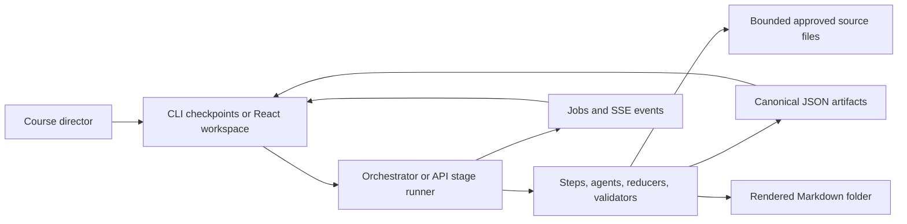
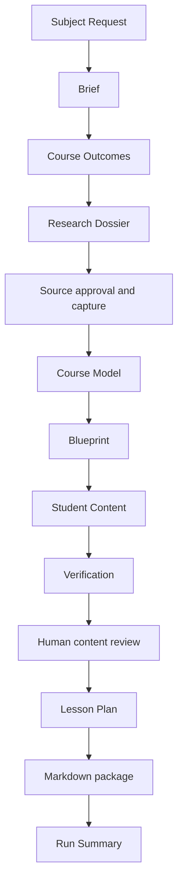

# Course Builder: Complete Technical Guide

> Code-level reference for the Course Builder prototype and Course Builder Studio.
>
> Snapshot reviewed: 2026-07-14. The implementation is the source of truth when
> this guide and an older planning document disagree.

## 1. Purpose of this guide

This document explains what the project is, why it is designed this way, what
every major part owns, and what happens from the first subject request to the
rendered course folder. It covers:

- the product goal and current acceptance boundary;
- the artifact contracts and lifecycle;
- every CLI pipeline and web product stage;
- intake, outcomes, research, source approval, structure, Blueprint, generation,
  verification, human review, revision, Lesson Plan, rendering, and summary;
- the exact prompt assembly mechanism and the purpose of every prompt template;
- Anthropic API calls, structured output, caching, retries, logging, and cost;
- the FastAPI application, job runner, workspace projection, and React frontend;
- validation, integrity checks, tests, fixtures, benchmarks, and evaluations;
- current limitations and the rationale behind the important design choices;
- a module and function ownership map.

The fastest way to learn the system is to read Sections 2 through 8 first, then
use the later sections as a reference while reading the code.

### 1.1 Navigation map

| If you need to understand... | Read... |
|---|---|
| Product purpose, current status, and honest boundaries | Sections 2 and 3 |
| Repository layout and canonical data | Sections 4 and 5 |
| CLI versus browser execution | Section 6 |
| Exactly what happens at every course stage | Section 7 |
| Exact prompt construction, model calls, cache, and cost | Section 8 |
| FastAPI jobs, decisions, state projection, and endpoints | Section 9 |
| React routes, views, actions, and fallback behavior | Section 10 |
| Persistence, resume, validation, and tests | Sections 11 and 12 |
| Commands for operating the project | Section 13 |
| Which module/function owns a behavior | Section 14 |
| Current gaps and recommended evolution | Section 15 |
| Architectural rationale and likely interview questions | Sections 16 and 17 |

## 2. What the project is trying to achieve

### 2.1 Long-term objective

The wider product vision is a "Chief of Staff": software that automates one
well-defined company process at a time while preserving human direction at the
decisions that matter. Course creation is the first process used to learn the
general patterns needed for that larger system.

The project therefore has two goals:

1. Build a genuinely useful course-building workflow.
2. Learn reusable patterns for process automation: artifact contracts, scoped
   context, human checkpoints, evidence boundaries, recovery, and auditability.

### 2.2 Course Builder objective

The Course Builder turns a sparse request such as "Coffee making" into:

- an explicit Course Brief;
- measurable course-level outcomes;
- competitor research and an approved factual source registry;
- a compact Course Model;
- a per-subtopic production Blueprint;
- selected learner assets with claim-level attribution and verification;
- a teacher-facing Lesson Plan;
- an organized Markdown course folder;
- a machine-readable run summary.

The intended operating model is not "the model produces a course and the human
accepts it blindly." The system does the repetitive production work. A course
director approves scope, sources, structure, production choices, content, and
delivery decisions.

### 2.3 Current status

The four-week backend prototype is complete as a successful engineering
prototype. It has:

- a deterministic local end-to-end acceptance path;
- a domain-neutral second-topic smoke test;
- one archived live end-to-end coffee run;
- a browser workspace over the same artifacts;
- API-backed stage execution and persisted review decisions.

It is not production-ready courseware automation. The archived live run proved
that the machinery completes, but it also produced unsupported, ungrounded, and
unattributed findings. A live run is learner-ready only after those blockers are
resolved and a human approves the content.

### 2.4 What is deliberately not claimed

The current project does not claim:

- that a first live draft is automatically learner-ready;
- that source search reliably finds the best evidence without human judgment;
- that verifier findings are automatically repaired end to end;
- that the model can assess pedagogical quality without human review;
- that DOCX, PPTX, SCORM, authentication, multi-user collaboration, distributed
  jobs, or production deployment are complete;
- that high-stakes subject matter can skip expert review.

## 3. The core mental model

The project is easiest to understand as four layers around one canonical data
model.



### 3.1 Canonical state is a set of artifacts

Each meaningful stage produces a JSON artifact under
`courses/<course_id>/<artifact_type>.json`. Artifacts are not incidental logs.
They are the durable contracts between stages and the audit trail a human
reviews.

### 3.2 The pipeline is explicit data

A pipeline is an ordered list of `Step` objects. Each step declares:

- its name;
- which artifact types it consumes;
- which artifact types it produces;
- the function that performs the work.

The runner is intentionally ignorant of course-specific body fields. This keeps
workflow mechanics separate from domain logic.

### 3.3 Expensive or subjective decisions are checkpoints

The system pauses between major artifacts. Generation completion and human
approval are different facts. A draft can exist on disk while the stage remains
`awaiting_review`.

### 3.4 Source metadata, source bodies, and generated prose are separate

- The Research Dossier explains what was found and considered.
- The approved source registry records exactly what may be used.
- Source files hold bounded source text.
- The Course Model stores only compact source references.
- Generated assets contain learner prose and a claim ledger.

This separation prevents competitor pages, rejected sources, or large source
bodies from silently entering generation context.

### 3.5 Context is selected deterministically

The project does not currently use vector search or RAG. Code selects context by
stable IDs from the approved Course Model and Blueprint. Every asset call gets
the current subtopic, relevant course constraints, its depth budget, the asset
plan, neighboring titles/context, and only its routed approved source excerpts.

### 3.6 Verification is independent from writing

The writer creates content and a claim ledger. A separate verifier call checks
each attributed claim against source text and searches the prose for factual
claims missing from the ledger. The verifier annotates; it does not rewrite.

## 4. Repository architecture

| Path | Responsibility |
|---|---|
| `orchestrator.py` | Generic artifact envelope, storage, checkpoints, revision loop, and CLI resume. |
| `run.py` | CLI entry point and all ordered pipeline definitions. |
| `steps.py` | Adapter functions that connect pipeline steps to domain agents. |
| `agents/` | Intake, outcomes, research, Course Model, Blueprint, content, verification, revision, review, and Lesson Plan logic. |
| `llm.py` | Anthropic Messages API wrapper, structured output, cache, usage log, and cost estimate. |
| `research_adapter.py` | Mock and bounded live search/fetch providers plus HTML/PDF extraction. |
| `source_selection.py` | Deterministic source decision and capture reducer. |
| `source_store.py` | Approved source excerpt persistence and bounding. |
| `course_model_integrity.py` | Semantic validation of Course Model and Blueprint graphs. |
| `integrity.py` | On-disk cross-artifact integrity checks, including legacy contracts. |
| `course_renderer.py` | Deterministic Markdown folder renderer. |
| `run_summary.py` | Final stage/unit/verifier status reduction. |
| `acceptance.py` | Deterministic content generator and verifier for local acceptance. |
| `api/` | FastAPI adapter, typed commands, artifact repository, stage runner, jobs, SSE, and workspace projection. |
| `frontend/` | React/TypeScript/Vite Course Builder Studio. |
| `prompts/` | Domain-neutral content and verification prompt templates. |
| `schemas/` | JSON Schema contracts for canonical artifacts. |
| `tests/` | Domain, integrity, API, frontend-contract, security, and acceptance tests. |
| `course_models/` | Curated v0.2 fixtures and the legacy FRM benchmark inputs. |
| `sources/` | Curated FRM and coffee source capsules used by fixtures. |
| `examples/` | Committed deterministic and live snapshots for review. |
| `benchmark/` | Manual FRM source materials and gold Content Package. |
| `evals/` | Mechanical scorecards, optional LLM comparison, blind review, ratification, and trends. |
| `runtime/` | Disposable API job state, SSE event logs, and mutation locks. |
| `courses/` | Runtime canonical artifacts. New course folders are ignored by Git. |
| `rendered_courses/` | Runtime Markdown output. Ignored by Git. |
| `.llm_cache/` | Prompt-hash response cache. Ignored by Git. |
| `logs/` | LLM usage and estimated-cost JSONL. Ignored by Git. |

## 5. Artifact model

### 5.1 The fixed envelope

`orchestrator.make_artifact()` wraps every body in the same metadata envelope:

```json
{
  "course_id": "coffee-course",
  "artifact_type": "course_model",
  "produced_by_step": "structure",
  "schema_version": "0.2",
  "status": "draft",
  "revision": 0,
  "revision_note": null,
  "inputs": ["brief", "course_outcomes", "research_dossier"],
  "updated_at": "2026-07-14T00:00:00+00:00",
  "body": {}
}
```

Field ownership matters:

- A step chooses identity, `schema_version`, `inputs`, and `body`.
- The orchestrator or API stage runner owns `status`, `revision`,
  `revision_note`, and `updated_at`.
- The orchestrator treats `body` as opaque.
- Domain validators, not the orchestrator, understand body shape.

### 5.2 Lifecycle

The principal lifecycle is:

```text
missing -> draft -> approved
             ^         |
             |         v
             +---- reopened/stale/revised
```

The web workspace derives richer UI states from envelope status, prerequisites,
timestamps, active jobs, verifier blockers, and content review:

`locked`, `ready`, `running`, `awaiting_review`, `approved`,
`requires_attention`, `stale`, and `failed`.

These UI states are projections. They are not added to the fixed artifact
envelope.

### 5.3 Stable ID conventions

Stable IDs connect all artifacts:

- modules: `m1`, `m2`;
- subtopics: `m1_s1`, `m1_s2`;
- course outcomes: `co1`, `co2`;
- concepts: `c_m1_s1_1`;
- coverage requirements: `cr_m1_s1_1`;
- source IDs: stable lowercase IDs such as `coffee_g1`;
- generated assets: subtopic plus suffix, such as `m1_s1_cc` or
  `m1_s1_summary`;
- claims: asset-specific IDs produced by the writer.

Downstream artifacts reference IDs instead of copying whole upstream objects.
This is what makes integrity checking, targeted revision, and selective context
assembly possible.

### 5.4 Artifact inventory

| Artifact | Producer | Main body contents | Main consumers |
|---|---|---|---|
| `subject_request` | Human, CLI, or API | Subject, description, known source locators, constraints | Intake |
| `brief` | Intake | Audience, purpose, scope, level, delivery, constraints, assumptions, provenance | Outcomes, research, Course Model |
| `course_outcomes` | Outcomes | Measurable outcome statements, cognitive levels, evidence, priority | Research, Course Model, content context |
| `research_dossier` | Research | Competitor findings, normalized topic coverage, implications, source candidates/failures | Source decision, Course Model |
| `approved_source_registry` | Source decision | Typed prompt metadata, selected/rejected IDs, approved source metadata and `content_ref` | Course Model |
| `course_model` | Structure | Metadata, rationale, modules, subtopics, concepts, coverage, dependencies, approved source registry | Blueprint, content, Lesson Plan, renderer, integrity |
| `blueprint` | Blueprint | Course defaults, per-subtopic depth budgets, selected/rejected asset plans, routed source IDs | Content, Lesson Plan, renderer |
| `content_package` | Student Content | Generated assets, claims, source unions, verification annotations | Review, Lesson Plan, renderer, summary, integrity |
| `content_progress` | Student Content | Per-unit status, retries, errors, expected/completed counts, completion flag | Run summary and workspace attention |
| `content_review` | Web review service | Per-asset fingerprint and human decision plus review summary | Content/package workspace gates |
| `lesson_plan` | Lesson Plan | Session constraints, coverage summary, sessions, live/self-study mode, talking points | Renderer |
| `render_manifest` | Renderer | Output format and paths for index, overview, sources, Lesson Plan, and assets | Run summary and UI package browser |
| `run_summary` | Run summary | Stage/unit totals, verifier totals, operator status, resume guidance, paths | Operator and UI |

### 5.5 Important body contracts

#### Subject Request v0.2

Required body fields are `subject`, `description`, `known_source_locators`, and
`constraints`. This is intentionally sparse; it records what the user actually
provided rather than pretending the complete course is already specified.

#### Course Brief v0.2

The Brief requires course title, subject, audience, prior knowledge, purpose,
level, duration, modality, language, in-scope and out-of-scope lists, must-have
topics, constraints, available materials, jurisdiction, accessibility,
assessment expectations, live-teaching constraints, tools/equipment, freshness,
assumptions, provenance, and unresolved decisions.

Every defaulted field is visible in `assumptions` and `provenance`. Defaults are
therefore explicit inputs, not hidden model behavior.

#### Course Outcomes v0.2

Each outcome has an ID, statement, cognitive level, evidence statement, and
priority. Course-level outcomes are design inputs. They are not the same as the
learner-facing Learning Objectives asset generated for each subtopic.

#### Research Dossier v0.2

The dossier contains:

- research scope;
- raw competitor findings and outline sections;
- normalized topics and cross-competitor coverage matrix;
- common-core topic IDs;
- sequence and gap observations;
- structural implications tied to outcomes/topics;
- all source candidates, including rejected and unavailable ones;
- explicit source failures.

It does not embed factual source bodies.

#### Course Model v0.2

The Course Model combines the old Table of Contents and Domain Model roles:

- `course_metadata` identifies course, audience, level, language, jurisdiction,
  and outcome IDs;
- `structural_rationale` explains why the structure was selected;
- `modules` and `subtopics` define order and dependencies;
- each subtopic has compact context, concepts, coverage requirements, and
  approved source IDs;
- `source_registry` contains only approved source metadata and content pointers.

Full source text, competitor narratives, generated prose, and production choices
do not belong in this artifact.

#### Blueprint v0.2

The Blueprint contains:

- course-wide depth and asset defaults;
- one plan for each subtopic;
- an explicit selected/proposed/rejected asset plan;
- per-asset approved source routing;
- a decision log;
- optional per-subtopic depth and asset exceptions.

The Blueprint answers "what should be produced and at what depth?" The Course
Model answers "what is the course and what must it cover?"

#### Content Package v0.2

Each subtopic contains generated assets. Every asset has:

- exact ID, type, title, and intended source format;
- learner-facing Markdown in `content`;
- optional teacher-only `solution` for assessments;
- a `claims` ledger;
- a derived `sources` union;
- verification totals;
- `file: null` until a later native packaging phase;
- `status: done` when generation succeeds.

Each claim has text, optional `source_id`, verifier support, exact supporting
excerpt, and note. Before verification the last three fields are null.

#### Content Review v0.1

This web-only canonical ledger records one human decision per generated asset:
`pending`, `approved`, or `changes_requested`. It also stores an asset fingerprint
and verifier blocker counts. A changed asset gets a new fingerprint and returns
to pending; unchanged reviews survive synchronization.

#### Lesson Plan

The Lesson Plan contains normalized session constraints, unresolved constraint
names, exact subtopic coverage, total time, ordered sessions, delivery mode, and
teacher talking points. It is deterministic in the current implementation.

## 6. Pipeline definitions and execution modes

### 6.1 Product flow



### 6.2 CLI pipeline variants

`run.py` exposes several pipelines because the prototype was delivered in
incremental gates.

| Builder | Purpose | Final output |
|---|---|---|
| `build_pipeline()` | Legacy/default FRM path with fixture-backed upstream artifacts | Lesson Plan |
| `build_sprint1_pipeline()` | Sparse request through mocked source selection | Approved source registry |
| `build_sprint2_pipeline()` | Sparse request through generated Course Model and Blueprint | Blueprint |
| `build_sprint3_pipeline()` | Full live-capable path | Rendered folder and run summary |
| `build_sprint4_acceptance_pipeline()` | Full deterministic local acceptance | Rendered folder and run summary |

The acceptance pipeline injects deterministic generation and verification
functions. The live pipeline uses the real Student Content and verifier agents.

### 6.3 Mock versus live research

`build_sprint2_pipeline(live_research=False)` uses the coffee mock provider.
Setting `live_research=True` uses `BoundedLiveResearchProvider`.

The deterministic acceptance path normally uses mock research plus deterministic
content. A live end-to-end run uses live research plus Anthropic generation and
verification.

### 6.4 CLI orchestration algorithm

`orchestrator.run_pipeline()` performs this exact sequence:

1. Save each seed artifact as approved if its meaningful content changed.
2. For each step, load every declared input from disk.
3. Load every declared output from disk.
4. Skip the step when all outputs are approved, newer than all current inputs,
   and their recorded input-type set matches the current step contract.
5. Otherwise call `step.run(inputs, feedback)`.
6. Set every output to draft, assign revision metadata, and save it.
7. Ask the injected approver to approve or request changes.
8. On approval, mark and save every output as approved.
9. On changes, increment the revision and rerun only that step with feedback.
10. On quit, raise `PipelineCancelled`; rerunning resumes from approved stages.

This is checkpoint resume, not a hidden autonomous agent loop.

### 6.5 Web stage execution is intentionally different

The browser cannot hold one HTTP request open across a series of human
checkpoints. The API therefore runs one product stage at a time:

1. The frontend sends a typed run or request-changes command.
2. `LocalJobRunner` persists a job and starts it in a bounded thread pool.
3. `StageRunner` loads approved prerequisites and invokes the existing step
   callable(s) for that product stage.
4. Produced artifacts are saved as draft.
5. SSE events report progress.
6. A separate approval command marks stage artifacts approved.

The domain pipeline is reused. The API is an adapter, not a second course
builder.

### 6.6 Product-stage mapping

| Product stage | Step names | Artifacts shown/approved | Prerequisites |
|---|---|---|---|
| Brief | `intake` | `brief` | `subject_request` |
| Outcomes | `course_outcomes` | `course_outcomes` | `brief` |
| Research & Sources | `research`; source choice is a typed command | `research_dossier`, `approved_source_registry` | `brief`, `course_outcomes` |
| Course Model | `structure` | `course_model` | Brief, outcomes, dossier, source registry |
| Blueprint | `blueprint` | `blueprint` | Course Model |
| Student Content | `student_content` | Content Package, progress, review ledger | Course Model, Blueprint, outcomes |
| Lesson Plan | `lesson_plan` | `lesson_plan` | Content Package, Blueprint, Course Model |
| Package | renderer and summary | render manifest, run summary | Course Model, Blueprint, content, progress, Lesson Plan |

## 7. Full stage-by-stage execution trace

### 7.1 Stage 0: Subject Request

#### CLI path

`run.main()` creates a Subject Request using:

- the `--subject` value, defaulting to `Coffee making`;
- a fixed prototype description about practical beginner results;
- a compact-prototype constraint;
- `--course-id`, or a slug ending in `-demo`.

`save_seed_artifact()` approves the human-supplied seed. If an already-approved
seed has the same body, inputs, and schema version, it is not rewritten. This
protects downstream resume from a meaningless timestamp update.

#### Web path

`POST /api/courses` accepts subject, optional description, constraints, known
source locators, and optional course ID. `DecisionService.create_course()`
validates that the ID is safe and does not already exist, then saves an approved
Subject Request.

The React creation form then sends a separate Brief answers command. If that
second request loses connectivity, the successful Subject Request is preserved
and the UI opens the Brief with a setup warning rather than creating a duplicate
course.

### 7.2 Stage 1: Course Brief

#### Intended typed intake contract

`agents/intake.py` declares 15 typed questions covering:

1. audience;
2. prior knowledge;
3. purpose;
4. level;
5. duration;
6. modality;
7. language;
8. in-scope material;
9. exclusions;
10. must-have topics/examples;
11. jurisdiction;
12. assessment expectations;
13. live-teaching constraints, shown only for live/blended/workshop delivery;
14. tools or equipment;
15. freshness/currentness requirements.

`QuestionSpec` provides visibility rules, defaults, coercion, validation, and
skip behavior. `visible_unresolved_questions()` emits at most five unresolved
questions per deterministic round. `gap_followups()` can produce at most three
safe follow-ups for sparse purpose, generic audience, scope conflict, or a
level/prior-knowledge conflict.

`ScriptedResponder` drives tests and non-interactive flows. The repository also
contains `TerminalInteractionRenderer`, but the main CLI pipeline currently
uses generic checkpoint feedback rather than running the full typed terminal
question sequence.

#### Current generation behavior

`steps.intake_step()` calls `build_brief_artifact()` with an empty answer set.
If the generic checkpoint supplies feedback, it is treated as a replacement
`purpose` answer.

The Brief builder merges explicit answers with safe defaults:

- general adult beginners;
- no assumed prior knowledge;
- practical working knowledge of the subject;
- beginner level;
- three hours self-paced;
- English;
- core concepts and practical application in scope;
- advanced specialist topics out of scope;
- practical examples required;
- short checks and scenario questions.

Known source locators become `available_materials`. Subject-request constraints
are merged with Brief constraints. Lists are normalized and deduplicated.

For each field, the builder records whether it came from the user or a default.
Every default creates a visible assumption with its value and rationale.

#### Web editing

The UI supports editing Overview, Audience, Scope, and Settings sections. Saving
rebuilds the Brief from the Subject Request and submitted answers, increments
revision, and leaves the artifact draft for explicit approval.

### 7.3 Stage 2: Course Outcomes

`draft_outcomes_from_brief()` deterministically creates four domain-neutral
outcomes:

- explain core concepts and vocabulary;
- apply a repeatable process to the primary in-scope focus;
- analyze common problems/tradeoffs in relation to the stated purpose;
- evaluate whether an approach fits learner constraints.

Each has a cognitive level, evidence statement, and core/supporting priority.
The structured outcome reducer supports select, reject, edit, add, and reorder.
It refuses to continue without at least one meaningful outcome.

The current CLI step drafts and accepts all four; generic checkpoint feedback
replaces the first statement. The API has a typed outcome decision endpoint,
although the current React stage is primarily a review view rather than a full
outcome editor.

Why outcomes happen before research: they tell research what learner result the
course must support. Otherwise competitor frequency can become the curriculum
by accident.

### 7.4 Stage 3A: Competitor research

`agents/research.py` uses the query:

```text
<subject> course outline beginner curriculum
```

Default bounds are eight competitor results, eight factual-source results, and
a minimum of three usable or partial public outlines.

For every competitor result, the provider returns a `CompetitorOutline`. The
analysis layer records raw ordered sections, normalizes labels into stable topic
IDs, builds a cross-course coverage matrix, identifies common-core topics, and
creates structural implications linked to course outcomes.

Competitor material is curriculum evidence only. It is not automatically an
approved factual source for learner claims.

### 7.5 Stage 3B: Research providers

#### Mock provider

`coffee_mock_provider()` supplies deterministic search results, three usable
outlines, one inaccessible competitor, source pages, and one intentionally weak
source. It exercises success, rejection, and failure paths without network or
API credentials.

#### Bounded live provider

`BoundedLiveResearchProvider` defaults to DuckDuckGo Lite HTML search. It:

- limits returned search results;
- uses an eight-second request timeout;
- retries network failures up to two times with bounded backoff;
- rejects responses above 2 MB;
- filters search-engine links;
- fetches approved pages only when source capture is requested;
- extracts visible HTML text while ignoring script/style/noscript;
- extracts up to 20 PDF pages with `pypdf`, with a limited ASCII fallback;
- finds likely curriculum labels in bounded windows after outline markers;
- filters navigation, footer, login, social, and unrelated page chrome.

The provider is intentionally simple. It does not use an LLM, authority model,
semantic ranker, or dedicated search API.

### 7.6 Stage 3C: Factual source candidates

The factual-source query is:

```text
<subject> factual guide reference evidence
```

Candidate construction is metadata-only. The system does not fetch candidate
bodies during search. Each candidate records ID, title, publisher, source type,
locator, status, trust notes, relevance notes, assigned node IDs, and decision
rationale.

Search results that look like competitor offerings are excluded from factual
source candidates. Results containing obvious weak-authorship markers are
pre-rejected. Human-provided sources can be added through the same candidate
shape.

### 7.7 Stage 3D: Source decision and capture

The structured source prompt includes every proposed or already-approved
candidate. At least one source must be selected.

For every selected source without a stored body:

1. Fetch the locator through the active research provider.
2. Reject it with an explicit failure when it has no locator, cannot be fetched,
   or exposes no text.
3. Normalize and store its text through `SourceStore`.
4. Write its `content_ref` and mark it approved.

Every unselected proposed source becomes rejected. The downstream registry
contains only approved sources with readable content references.

`SourceStore` persists Markdown under the configured source root and caps each
stored excerpt at 12,000 normalized characters. The current implementation
takes the first 12,000 characters; it does not yet select relevant sections.

CLI unattended defaults choose at most two mock sources or six live sources.
The web workflow deliberately stops after research candidates and requires an
explicit source decision command before the Research stage can be approved.

### 7.8 Stage 4: Course Model

Course Model generation is deterministic Python, not an LLM call.

#### Topic selection

`_select_topics()` combines, in order:

- competitor common-core topics;
- topics referenced by structural implications;
- Brief in-scope topics;
- Brief must-have topics.

It normalizes and deduplicates topics, filters exclusions, adds generic
foundations/workflow/practice/troubleshooting fallbacks until there are at least
four, and caps the result at eight.

#### Module construction

The first four topics become Module 1. Remaining topics become Module 2. Each
subtopic gets:

- stable order and ID;
- a compact purpose and scope context;
- a dependency on the preceding subtopic;
- one compact concept;
- one coverage requirement;
- approved source IDs.

Modules also form a linear prerequisite chain.

#### Current source-to-topic routing

Source matching compares topic tokens with source title, publisher, and source
type. If nothing matches, the first approved source is used. This is simple and
deterministic, but it is not content-aware relevance routing.

#### Validation

Course Model semantic validation checks duplicate IDs, missing dependencies,
cycles, source registration/approval, concept and coverage references, outcome
coverage, research rationale references, and banned embedded source-text fields.

### 7.9 Stage 5: Blueprint

Blueprint generation is also deterministic Python.

#### Course defaults

The model level is converted into an introductory, intermediate, advanced, or
custom depth. Target learning time is 20, 30, or 40 minutes depending on depth.
The target word count is `minutes * 55`, with a bounded range around it.

Default assets are Learning Objectives, Course Content, Summary, and Assessment,
but per-subtopic selection is more specific.

#### Per-subtopic selection heuristics

Every subtopic starts with:

- Learning Objectives;
- Course Content;
- Summary.

Then:

- even-numbered subtopics get Activities;
- practice/workflow/ratio/recipe topics get Assessment;
- diagnosis/troubleshooting/taste/case topics get Case Study and Assessment;
- the first subtopic gets Additional Resources.

Every catalog asset is represented in the plan. Selected assets are marked
`selected`; the rest initially remain `proposed`. Selected assets inherit the
subtopic's approved source IDs.

The generated catalog has seven asset types. The Student Content agent still
supports two legacy/richer FRM types, Important Person and Did You Know, when a
Blueprint fixture selects them.

#### Human Blueprint decisions

`apply_blueprint_decision()` can change selected assets and depth per subtopic.
It enforces:

- known subtopic IDs;
- known asset types;
- at least one selected asset;
- Course Content as the anchor unless an explicit waiver is recorded;
- a bounded set of depth override fields.

Every exception is recorded in the decision log.

### 7.10 Stage 6A: Work-unit planning

`whole_course.build_work_units()` walks Blueprint-planned subtopics in Course
Model order. Within each subtopic it sorts Course Content first and keeps the
remaining selected asset order.

Each work unit records subtopic ID, asset type, asset ID, title, and intended
format.

Before generation, the coordinator:

- reuses an existing asset whose status is `done` and whose content is a string;
- records an `evidence_gap` when the selected asset has no routed source IDs;
- records dependent assets as pending if their Course Content anchor is absent;
- retries failed generation once by default;
- continues other independent units after a failure;
- preserves successful assets for a future resume.

This produces both a partial/complete Content Package body and a detailed
Content Progress body.

### 7.11 Stage 6B: Generation context slicing

For one asset, `_build_prompt_context()` supplies:

- course ID, title, subject, audience, and outcomes;
- parent module ID/title/context;
- exact target asset identity;
- complete focus-subtopic compact slice;
- coverage requirements;
- sibling subtopic titles/context to avoid duplication;
- legacy allocation if present;
- depth budget;
- asset-specific instructions or purpose;
- metadata for routed sources;
- the allowed source ID list;
- bounded routed source text.

It does not supply the full course corpus. Source IDs are first checked against
the subtopic's approved set and then against the Course Model source registry.
Any unapproved or unknown route fails before the model call.

### 7.12 Stage 6C: Asset generation

`student_content.generate_asset()` performs:

1. Resolve the generic asset spec against the Blueprint.
2. Confirm the asset was selected.
3. Build the deterministic context slice.
4. Load the asset's prompt template.
5. Insert JSON context, bounded source blocks, revision feedback, and for
   dependent assets the finished Course Content text.
6. Build an Anthropic JSON Schema for the expected asset.
7. Call `llm.call()`.
8. Parse structured output.
9. Validate identity, content, solution rules, claim IDs, source IDs, empty
   pre-verification state, and status.
10. Derive the asset's `sources` field from non-null claim source IDs.

The model is not allowed to decide its own ID, type, title, format, file path,
or status. Those must exactly match the approved spec.

### 7.13 Stage 6D: Mechanical depth loop

`generate_asset_to_depth()` applies the Blueprint word floor and required
sections only to Course Content unless an individual supporting asset explicitly
defines its own limits.

For Course Content, a `targeted_by_coverage_gap` expansion policy allows up to
three attempts. A short draft is regenerated with named mechanical shortfalls.
After the bounded attempts, generation fails rather than padding indefinitely.

This is a mechanical guard, not a semantic quality score. Coverage quality and
factual support are handled separately.

### 7.14 Stage 6E: Content Package assembly

The package body contains the supported asset vocabulary and one entry per
generated subtopic. `content_progress.complete` is true only when generated
asset count exactly equals planned work-unit count and no failed, pending, or
evidence-gap unit remains.

Only a complete initial package is sent to package-wide verification. A partial
package is still persisted so successful work can be resumed. This recovery
choice is useful, but the current pipeline can continue to later rendering if a
human approves the partial checkpoint; this is one of the current gaps listed
in Section 15.

### 7.15 Stage 6F: Adversarial verification

Verification makes one independent LLM call per asset, sequentially.

The verifier receives:

- asset ID, type, title, full learner content, and optional solution;
- each claim's ID, text, and source ID;
- only sources routed to that asset;
- the adversarial verification prompt.

For every attributed claim it must return exactly one verdict:

- `supported`: the complete claim is directly supported;
- `partial`: only part is supported or the claim overstates evidence;
- `unsupported`: the cited source does not support it.

Supported and partial verdicts require an exact contiguous substring from the
cited source. Unsupported verdicts require a null excerpt. Claims with no source
ID are counted as ungrounded and are not sent back as ordinary verdicts.

The verifier also reads the complete content and solution to identify significant
factual claims missing from `claims[]`; these become `unattributed_found`.

Deterministic response validation checks exact keys, known claim IDs, one verdict
per attributed claim, valid support labels, exact source substrings, reconciled
counts, and unique non-empty unattributed findings.

If validation fails, the verifier gets one correction attempt. After that, a
conservative fallback can discard unknown/duplicate verdicts, mark missing
verdicts unsupported, and downgrade verdicts whose excerpts cannot be proven.
It never upgrades a verdict.

The verifier preserves learner content and the claim-derived source union byte
for byte. It only annotates claims and verification totals.

### 7.16 Stage 6G: Human content review

When the API produces a Content Package, it synchronizes `content_review.json`.
Each asset gets a SHA-256 fingerprint over its review-relevant fields.

- Existing decisions survive if the fingerprint is unchanged.
- Changed assets return to pending.
- `changes_requested` requires written feedback.
- `ready_for_package` requires every asset approved and zero unsupported,
  ungrounded, or unattributed blockers.

Partial verifier findings are shown for human judgment but are not included in
the hard blocker total.

### 7.17 Stage 6H: Targeted revision

The revision parser accepts:

```text
m1_s1_summary: make this more concise
summary: make this more concise
verifier
verifier: preserve the example but narrow unsupported claims
{"subtopic_id":"m1_s1","assets":["m1_s1_summary"],"feedback":"...","verifier":true}
```

`verifier` selects assets containing partial/unsupported claims, null-source
claims, or unattributed findings. Whole-course revision must resolve to exactly
one subtopic; otherwise the caller must specify `subtopic_id`.

Revision regenerates Course Content first when selected, then regenerates only
the selected dependent assets using the latest anchor. Each revised asset is
reverified immediately. Unselected assets remain unchanged and in their original
order.

The current web "Revise with approved evidence" action sends a targeted JSON
request to the Content stage. "Find better evidence" sends scoped feedback to
the Research stage, but there is not yet a complete automatic source-repair,
reroute, regenerate, and reverify transaction.

### 7.18 Stage 7: Lesson Plan

Lesson Plan generation is deterministic and uses only generated subtopics.

For each subtopic it:

- reads target learning minutes from the Blueprint, defaulting to 30;
- chooses `live` when Activities, Case Study, or Assessment exists;
- otherwise uses the configured default mode, currently `live`;
- writes talking points based on selected asset types.

Subtopics are packed into sessions up to two hours. A single oversized subtopic
is kept and reported as an unresolved constraint. Calendar dates, instructor
count, and delivery platform are explicitly listed as unresolved when absent.

Validation requires positive durations, sequential unique sessions, known
subtopics, valid modes, non-empty talking points, and each generated subtopic
exactly once in order.

### 7.19 Stage 8A: Markdown rendering

`course_renderer.render_course_folder()` deletes only the existing course output
directory after checking it is inside the configured output root and is not a
symlink. This avoids stale files after asset selection changes.

It writes:

```text
rendered_courses/<course_id>/
  README.md
  course_overview.md
  source_index.md
  lesson_plan.md
  modules/
    01_<subtopic-id>_<title>/
      01_<asset-id>_<asset-type>.md
      ...
```

Asset Markdown includes learner content, optional assessment solution, claim
ledger, and verification totals. The Blueprint's `format` values such as DOCX
or PPTX are planning metadata; the prototype renderer still writes Markdown.

### 7.20 Stage 8B: Run Summary and integrity

The run summary counts stage records, content-unit statuses, and verifier totals.
`operator_status` is `requires_attention` when there is:

- any failed stage or unit;
- any evidence-gap or pending unit;
- any unsupported, ungrounded, or unattributed verifier result.

Partial findings do not automatically block. Pending stage review produces
`pending_review`; otherwise status is `complete`.

`integrity.py` separately validates the complete on-disk reference graph. For
the current v0.2 path it checks:

- Course Model and Blueprint semantics;
- selected Blueprint subtopics/assets exactly match the Content Package;
- asset and claim sources are registered, subtopic-approved, and asset-routed;
- each asset `sources` list equals the non-null claim source union;
- Lesson Plan coverage references valid subtopics exactly once.

It also retains legacy TOC/Domain Model checks for historical FRM artifacts.

## 8. Prompt and LLM system

### 8.1 Which stages use an LLM today

In the main current path, only Student Content generation and verification use
an LLM. Intake, outcomes, research analysis, Course Model, Blueprint, Lesson
Plan, rendering, summary, and integrity are deterministic Python. Live research
uses ordinary HTTP search/fetch and parsing, not an LLM.

The evaluation tool can optionally use an LLM as a provisional comparison
judge, but that judge cannot pass the human quality gate.

### 8.2 Current provider and model

`llm.py` is directly coupled to the Anthropic Python SDK. More precisely, this
project uses the ordinary Anthropic Messages API client (`anthropic.Anthropic`),
not the Claude Agent SDK. There is no provider-owned autonomous-agent runtime in
the architecture. The default model is:

```text
claude-opus-4-8
```

The pricing table also knows Sonnet 4.6 and Haiku 4.5. Callers may pass another
model string, but unknown models receive no cost estimate. There is no
provider-neutral adapter or per-task model-routing policy yet.

### 8.3 System prompts

Student Content uses this system role:

```text
You are the Course Builder Student Content agent. Generate only grounded,
schema-valid JSON for the requested asset.
```

Verification uses:

```text
You are the Course Builder adversarial fact-checker. You did not write the
asset. Judge every citation only against the supplied source text and return
only schema-valid JSON.
```

### 8.4 Runtime prompt assembly

For a content asset, the exact runtime user prompt is:

```text
prompts/<asset>.md
  with {{CONTEXT_JSON}} replaced by the deterministic context slice
  with {{SOURCE_TEXTS}} replaced by routed bounded source blocks
  with {{COURSE_CONTENT}} replaced by the anchor text for dependent assets
  with {{FEEDBACK_SECTION}} replaced by baseline or revision instructions
```

Source blocks include source ID, name, category, URL, file reference, and source
text. `CONTEXT_JSON` contains source metadata but excludes the duplicate source
text array.

For verification, `prompts/verification.md` receives a reduced asset JSON and
registered source text blocks wrapped in `<SOURCE_TEXT>` tags.

The complete exact prompt wording remains canonical in `prompts/`. This guide
describes how it is used so the templates do not have to be duplicated and
allowed to drift here.

### 8.5 Prompt inventory

| Template | Purpose | Special rules | Max output tokens |
|---|---|---|---:|
| `course_content.md` | Full anchor lesson for one subtopic | Must satisfy coverage/depth; significant claims in ledger | 12,000 |
| `learning_objectives.md` | Measurable subtopic objectives | Must reflect what anchor content actually teaches | 3,500 |
| `summary.md` | Study-aid recap | No new topics or facts beyond anchor | 7,000 |
| `case_study.md` | Grounded scenario and analysis | Must stay consistent with anchor and approved evidence | 8,000 |
| `assessment.md` | Questions plus teacher answer key | Only asset allowed to return `solution` | 9,000 |
| `important_person.md` | Profile of a configured person | Must not invent/select a person | 6,000 |
| `did_you_know.md` | Compact configured editorial hook | Must not invent a replacement hook | 6,000 |
| `activities.md` | Practical learner activities | Must be answerable from anchor and stated learner inputs | 7,000 |
| `resources.md` | Approved reading/reference list | May use only supplied metadata/URLs | 7,000 |
| `verification.md` | Adversarial factual and attribution check | Does not judge pedagogy or rewrite | 8,000 |

#### Template-specific instructions

`course_content.md` asks for the complete lesson, useful Markdown headings,
proportionate explanation of every coverage requirement, and substantive depth
rather than word-count padding. If evidence is missing, it tells the writer not
to invent facts and to make the limitation visible.

`learning_objectives.md` asks for observable action verbs at the configured
audience/depth. Objectives must collectively map to approved coverage but cannot
test anything the already-generated Course Content does not teach. Pedagogical
objective language normally needs no factual claim entry.

`summary.md` asks for a concise study aid, not a second lesson. It must preserve
the anchor's emphasis and may not preview new topics or add facts absent from
Course Content.

`case_study.md` asks for a grounded scenario, relevant decisions, and analysis
within the configured case depth. The case must be answerable from the approved
course material and evidence, and it cannot contradict the anchor lesson.

`assessment.md` asks for the configured assessment type and complexity, with a
learner-facing question set in `content` and a complete teacher-only answer key
in `solution`. Questions must assess approved taught material rather than trivia
from unrelated source passages.

`important_person.md` can only profile a person explicitly configured in the
asset instructions. It asks for a focused contribution and bridge to the
subtopic, not a broad biography, and forbids invented dates, credentials,
affiliations, works, quotations, and attributed ideas.

`did_you_know.md` can only use the configured editorial hook. It asks for a
compact, memorable explanation connected to the anchor and forbids replacing
the hook with a model-selected fact.

`activities.md` asks for practical learner participation with configured count,
mode, progression, grouping, timing, and outputs. Activities must be possible
using the Course Content plus any inputs they explicitly ask the learner to
provide.

`resources.md` asks for a concise approved reading/reference list. It may only
reproduce supplied source metadata and URLs, must explain relevance to the
anchor, and must not invent or repair titles, editions, authors, links, or access
conditions.

`verification.md` tells the checker to distrust citations until the cited source
directly supports the complete claim. It excludes teaching quality, tone,
coverage, and rewriting from scope; those remain human/evaluation concerns.

### 8.6 Shared content-prompt rules

All content templates are domain-neutral and enforce the same broad contract:

- follow the approved subtopic, coverage, depth, and asset instructions;
- use only supplied approved sources for factual claims;
- put every significant factual claim in `claims[]`;
- cite only valid source IDs;
- reserve `source_id: null` for synthesis, transitions, or clearly hypothetical
  framing that needs no factual evidence;
- keep learner prose free of internal claim IDs and citations;
- copy target identity fields exactly;
- return only one JSON asset;
- initialize verification fields to the empty pre-verification state;
- apply revision feedback without disturbing approved unaffected material.

### 8.7 Structured output schema

The content call asks Anthropic for one JSON object with no extra properties.
All assets require identity, content, claims, sources, verification, file, and
status. Assessments additionally require `solution`.

The API schema is intentionally broad enough for Anthropic's supported JSON
Schema subset. `_validate_and_normalize_asset()` enforces stricter application
rules afterward.

### 8.8 Anthropic call behavior

`llm.call()`:

1. Hashes model, system prompt, messages, max tokens, JSON schema, and optional
   thinking configuration using canonical JSON and SHA-256.
2. Returns `.llm_cache/<hash>.json` when caching is enabled and a hit exists.
3. Requires `ANTHROPIC_API_KEY` only when a live call is actually needed.
4. Uses SDK retry with `max_retries=4` for provider throttling/server failures.
5. Uses streaming automatically above 8,000 max output tokens to avoid the
   SDK's long non-streaming request guard.
6. Rejects truncation, refusal, context overflow, and unexpected stop reasons.
7. Concatenates text blocks and parses JSON when a schema was supplied.
8. Caches the result.
9. Appends usage, latency, cache status, and estimated cost to
   `logs/llm_calls.jsonl`.

A local cache hit records zero newly consumed API tokens in the usage log.

### 8.9 Call volume

For a complete live run with `N` selected assets:

- generation normally costs at least `N` calls;
- each short Course Content can add up to two regeneration calls;
- verification costs another `N` calls;
- verifier validation can add one retry per problematic response;
- targeted revision costs generation plus verification only for selected assets.

The archived coffee live run used 37 Claude calls for 18 assets. This is why
source bounding, response caching, narrower asset selections, and future
per-task model routing materially affect cost.

## 9. FastAPI application

### 9.1 Architectural role

The API is a local application adapter around the existing domain code. The
domain does not import FastAPI or React. Canonical JSON artifacts remain the
source of truth.

### 9.2 Application services

#### ArtifactRepository

Provides confined, atomic access to runtime courses and read-only examples. It:

- validates course IDs and allowlisted artifact types;
- prevents path traversal;
- discovers runtime and committed example courses;
- loads canonical JSON;
- saves through a temporary file plus `os.replace`;
- supports expected-checksum optimistic concurrency;
- safely serves rendered files;
- computes canonical SHA-256 checksums.

Committed acceptance and live snapshots are discoverable but read-only.

#### PipelineCatalog

Maps executable steps from `run.py` into the eight product stages. Deterministic
mode uses the acceptance pipeline; live mode uses the live Sprint 3 pipeline.

#### StageRunner

Runs one stage using existing `Step` functions. It requires approved
prerequisites, saves outputs as draft, emits progress events, and synchronizes
the content-review ledger after content generation.

Live Content checks for `ANTHROPIC_API_KEY` before execution. Live Research does
not require that key because its provider is HTTP-based.

#### DecisionService

Owns typed, short-lived human mutations: create course, save Brief answers,
decide outcomes/sources/Blueprint, approve/reopen stages, and save content review
decisions. It calls domain reducers rather than reimplementing them.

#### LocalJobRunner

Persists jobs under `runtime/<course_id>/jobs/` and events under
`runtime/<course_id>/events/`. It uses:

- a bounded thread pool;
- one active mutation per course;
- an in-process lock plus a non-blocking `fcntl` file lock;
- durable queued/running/completed/failed status;
- recovery that marks interrupted queued/running jobs failed after restart.

The project should run one API worker. Multiple Uvicorn workers would each have
their own in-process executor and weaken the intended local execution model,
even though the file lock still protects course mutation.

#### WorkspaceProjector

Reads artifacts and jobs, then derives course title, current stage, next action,
attention, stage states, checksums, assets, and operator status. It overrides an
old archived `run_summary: complete` when current verifier evidence contains
blockers.

### 9.3 HTTP endpoints

| Method and path | Responsibility |
|---|---|
| `GET /api/health` | API status, deterministic readiness, Anthropic readiness, frontend build state |
| `GET /api/courses` | List runtime and committed courses |
| `POST /api/courses` | Create approved Subject Request |
| `GET /api/courses/{id}/workspace` | Derived course workspace summary |
| `GET /api/courses/{id}/stages/{stage}` | Stage state plus artifact bodies/checksums |
| `GET /api/courses/{id}/artifacts/{type}` | One canonical artifact |
| `POST .../stages/{stage}/run` | Queue a ready/stale/failed stage |
| `POST .../stages/{stage}/approve` | Approve all required stage outputs |
| `POST .../stages/{stage}/reopen` | Return stage outputs to draft |
| `POST .../stages/{stage}/request-changes` | Queue stage rerun with feedback |
| `PUT .../brief/answers` | Rebuild Brief from typed answers |
| `PUT .../outcomes/decision` | Apply outcome selection/edit/add/order |
| `PUT .../research/sources/decision` | Capture and save explicit source choice |
| `PUT .../blueprint/decision` | Apply asset/depth exceptions |
| `GET .../content/assets` | List asset summaries |
| `GET .../content/assets/{asset_id}` | Return one requested asset |
| `GET .../content/reviews` | Read review ledger |
| `POST .../content/reviews/sync` | Synchronize review fingerprints |
| `PUT .../content/reviews/{asset_id}` | Save one human review decision |
| `GET .../outputs/{path}` | Serve a confined rendered file |
| `GET /api/jobs/{job_id}` | Read durable job status |
| `GET /api/jobs/{job_id}/events` | SSE stream |
| `GET /api/jobs/{job_id}/events/snapshot` | Persisted event snapshot |

All command bodies reject unknown fields. Versionable mutations accept an
expected checksum and return HTTP 409 when a stale client would overwrite newer
state.

### 9.4 SSE event flow

The implemented event vocabulary includes:

```text
job.queued
job.started
stage.started
unit.completed
unit.failed
stage.output_ready
checkpoint.awaiting_review
job.completed
job.failed
```

Events contain IDs, course/job identity, timestamp, stage, optional unit
identity, progress, and a human-safe message. Prompts, source bodies, and hidden
model reasoning are not streamed.

## 10. React frontend

### 10.1 Stack and routes

The frontend uses React 19, TypeScript, Vite, React Router, TanStack Query,
React Markdown, Vitest, and Testing Library.

Routes are:

```text
/                         -> /courses
/courses                  -> dashboard
/courses/new              -> creation form
/courses/:courseId        -> redirects to current stage
/courses/:courseId/:stage -> eight-stage workspace
```

Vite runs on port 5173 and proxies `/api` to `127.0.0.1:8000`. A production
Vite build can be served by FastAPI from the same process.

### 10.2 API normalization

The frontend does not render raw backend artifacts directly. `client.ts` loads
the workspace plus every stage projection, builds an artifact map, and
normalizes snake_case artifact bodies into typed UI structures for Brief,
outcomes, research, modules, Blueprint, content, Lesson Plan, and package.

When the API is unreachable, the dashboard/workspace falls back to local demo
data. This is preview behavior, not persisted domain state.

### 10.3 Workspace layout

The workspace provides:

- an eight-stage workflow rail;
- a stage-specific canvas;
- a context inspector with Why, Evidence, Links, History, and Raw views;
- an activity drawer;
- a sticky decision bar;
- a live/deterministic run-mode selector;
- job progress and toast feedback.

Navigation pauses while a mutating stage job is active.

### 10.4 Stage views

- Brief shows scope, audience, settings, assumptions, and section editors.
- Outcomes shows measurable outcomes and evidence.
- Research shows competitor findings and explicit source-selection controls.
- Course Model shows module/subtopic hierarchy and details.
- Blueprint shows defaults, per-subtopic depth, selected assets, source routes,
  and exceptions.
- Student Content shows pre-generation readiness, production board, Markdown
  reader, claims, verifier detail, repair actions, and per-asset human review.
- Lesson Plan shows session timeline and coverage.
- Package shows release checks and rendered output tree.

Some controls are intentionally read-only or disabled in the current release,
including direct Course Model edits, full outcome editing, Lesson Plan constraint
editing, file-content preview inside the package panel, and some repair workflow
steps.

### 10.5 Decision behavior

The primary decision bar adapts to state:

- `ready`, `stale`, or `failed`: run the stage;
- `awaiting_review`: approve or request changes;
- `requires_attention`: request changes/repair rather than silently continue;
- `approved`: move to the next stage;
- `locked`: explain which upstream decision is missing.

Research approval is blocked until an approved source registry has been saved.
Content package readiness additionally depends on the durable per-asset review
ledger and verifier blockers.

### 10.6 Security boundaries

- API keys stay in the Python process and never enter browser configuration.
- Course IDs, artifact types, and rendered paths are validated server-side.
- Committed examples cannot be mutated.
- Source text is not returned in the workspace summary.
- Optimistic concurrency protects against stale browser decisions.
- The current browser UI renders generated Markdown through React Markdown or
  controlled data views rather than executing source HTML.

## 11. Storage, freshness, and recovery

### 11.1 Canonical versus disposable data

Canonical:

- `courses/<course_id>/*.json`;
- approved source files referenced by artifacts;
- rendered course output for the current run;
- content-review decisions.

Disposable/rebuildable:

- `.llm_cache/`;
- `logs/`;
- `runtime/` jobs/events/locks;
- `rendered_courses/` when canonical artifacts still exist.

### 11.2 CLI freshness

The CLI considers approved outputs current when their timestamps are at least as
new as all loaded inputs and their recorded input-type set equals the current
step contract.

### 11.3 Web freshness

The workspace marks a stage stale when an approved output predates a prerequisite
artifact. Stage and artifact checksums protect individual commands from concurrent
updates.

### 11.4 Recovery cases

- CLI quit: approved stages remain; rerun the same command.
- Generation failure: successful assets remain in the partial Content Package;
  the next run skips completed assets and retries missing units.
- API process restart: active jobs are marked failed with an interrupted-job
  message; canonical artifacts remain resumable.
- Changed content asset: only that asset's human review resets.
- Changed upstream artifact: downstream approved artifacts become stale by
  timestamp and rerun when selected.

## 12. Validation and quality evidence

### 12.1 JSON Schema

The repository has v0.2 schemas for Subject Request, Brief, Outcomes, Research
Dossier, Course Model, Blueprint, and Content Package, plus v0.1 Content Review.
Schemas reject wrong artifact identity, wrong primitive shapes, missing required
fields, and unexpected properties.

The project includes a dependency-free JSON Schema subset validator for the
Content Package test contract.

### 12.2 Semantic and referential validation

JSON Schema cannot express graph cycles, cross-artifact source approval, or exact
Blueprint-to-package reconciliation cleanly. Those checks live in
`course_model_integrity.py` and `integrity.py`.

Keeping these validators outside the orchestrator preserves the orchestrator's
opaque-body invariant.

### 12.3 Deterministic acceptance

`acceptance.py` supplies domain-neutral local implementations that still pass
through Blueprint resolution and source-routing gates. The deterministic writer
creates compact grounded placeholder content; the deterministic verifier marks
attributed claims supported.

This proves orchestration, checkpoints, source boundaries, asset selection,
resume, revision, rendering, and integrity. It does not prove learner-content
quality.

### 12.4 Live evidence

The archived `examples/live-runs/coffee-live-main/` snapshot contains:

- all pipeline artifacts;
- two approved source captures;
- 18 selected/generated/rendered assets;
- 37 Claude calls;
- claim-level verification;
- about 9,200 words of learner content.

Its verification totals are 109 supported, 14 partial, 5 unsupported, 1
ungrounded, and 3 unattributed. The archived summary says complete because it
predates the current attention-gate fix; the current workspace correctly
projects it as requiring attention.

### 12.5 Test coverage map

The test suite covers:

- typed intake and choice validation;
- research parsing, bounds, failures, and source capture;
- source rejection and leakage prevention;
- Course Model/Blueprint schema and semantic integrity;
- domain-neutral prompt/context behavior;
- selected-asset enforcement and evidence-gap behavior;
- whole-course partial failure and resume;
- structured asset contracts and claim/source unions;
- verifier response validation, retry, and conservative fallback;
- targeted revision preservation;
- Lesson Plan, rendering, run summary, and final acceptance;
- API commands, projections, checksums, locks, jobs, events, and security;
- frontend contract and archived snapshot reconciliation;
- human content-review persistence;
- deterministic scorecards, blind review, ratification, and trends.

### 12.6 Benchmark and evaluation tooling

The FRM benchmark contains original manual DOCX/PPTX/XLSX inputs, extracted
Markdown, and a gold v0.2 Content Package.

`evals/compare.py` separates:

- deterministic mechanical evidence;
- optional LLM head-to-head proposals for coverage/style;
- blind human review, which alone can ratify the gate.

Its quality dimensions include factual accuracy, coverage, source attribution,
pedagogical clarity, asset completeness, house style, and review time. Passing
requires acceptable core-asset scores, bounded review time, light edit extent,
and completed untampered blind human review.

## 13. Running the project

### 13.1 Install

```bash
python3 -m venv .venv
.venv/bin/pip install -r requirements-dev.txt
cd frontend
npm install
```

### 13.2 Deterministic end-to-end acceptance

```bash
python3 run.py --acceptance-demo --course-id coffee-acceptance --auto-approve
python3 integrity.py coffee-acceptance
```

Remove `--auto-approve` to use the generic CLI approve/changes/quit checkpoints.

### 13.3 Live pipeline

```bash
python3 run.py --sprint3-demo --live-research --subject "Coffee making" --course-id coffee-live
python3 integrity.py coffee-live
```

Set `ANTHROPIC_API_KEY` in the environment or `.env`. Do not use
`--auto-approve` as a real source/content quality workflow.

### 13.4 Web application

Terminal 1:

```bash
.venv/bin/uvicorn api.main:app --reload
```

Terminal 2:

```bash
cd frontend
npm run dev
```

Open `http://localhost:5173`.

For one-process serving:

```bash
cd frontend
npm run build
cd ..
.venv/bin/uvicorn api.main:app
```

### 13.5 Verification commands

```bash
python3 -m pytest -q
ruff check .
cd frontend && npm test && npm run build
```

## 14. Module and function ownership reference

This section is a practical map of what to open when debugging or explaining a
specific behavior. Private helpers are grouped by job where listing every small
normalizer individually would obscure ownership.

### 14.1 Core execution modules

#### `orchestrator.py`

- `make_artifact`: creates the fixed envelope.
- `course_dir`, `artifact_path`: derive plain-file locations.
- `save_artifact`, `load_artifact`: JSON persistence.
- `save_seed_artifact`: avoids meaningless seed rewrites.
- `_approved_outputs_current`: timestamp-based resume freshness.
- `console_approver`: generic approve/changes/quit loop.
- `artifact_summary`: compact body-agnostic terminal summary.
- `run_pipeline`: ordered load, skip, run, save, revise, and approve engine.
- `Step`, `Decision`, `PipelineCancelled`: execution data contracts.

#### `run.py`

- `build_pipeline`: legacy FRM path.
- `build_sprint1_pipeline`: intake through source decision.
- `build_sprint2_pipeline`: intake through Blueprint.
- `build_sprint3_pipeline`: full live-capable path.
- `build_sprint4_acceptance_pipeline`: full deterministic injected path.
- `auto_approver`: unattended acceptance approver.
- `main`: CLI parsing, seed creation, pipeline choice, cancellation, integrity.

#### `steps.py`

- intake/outcome/research functions adapt artifacts to agents.
- `source_selection_step` captures sources and writes the registry.
- `structure_step` chooses generated v0.2 or legacy fixture behavior.
- `blueprint_step` chooses generated v0.2 or legacy fixture behavior.
- `make_student_content_step` injects deterministic/test services.
- `_student_content_step` owns baseline generation versus targeted revision and
  package verification.
- Lesson Plan, renderer, and summary step functions wrap their domain services.
- private research helpers select fixtures/providers and unattended source limits.

### 14.2 Interaction and upstream design

#### `interaction.py`

- `QuestionSpec`: typed field question with visibility/default/validation.
- `ChoiceOption`, `ChoicePrompt`, `ChoiceDecision`: structured human selection.
- `ScriptedResponder`: deterministic tests/demos.
- `TerminalInteractionRenderer`: provider-independent terminal form renderer.

#### `agents/intake.py`

- declares every Brief question and field order;
- creates safe course IDs and Subject Requests;
- finds unresolved questions and bounded follow-ups;
- detects ambiguity and scope/level conflicts;
- builds the Brief, defaults, assumptions, and provenance.

#### `agents/outcomes.py`

- drafts four domain-neutral outcomes;
- builds structured selection prompts;
- applies select/edit/add/reorder decisions;
- writes the Course Outcomes artifact.

### 14.3 Research and sources

#### `research_adapter.py`

- `SearchResult`, `FetchResult`, `CompetitorOutline`: provider data contracts.
- `ResearchProvider`: adapter protocol.
- `BoundedLiveResearchProvider`: bounded search, fetch, retry, HTML/PDF parsing,
  and outline extraction.
- `MockResearchProvider`, `coffee_mock_provider`: deterministic fixtures.
- private parsers normalize text/links, identify outline windows, filter page
  chrome, and decode content safely.

#### `agents/research.py`

- builds the complete dossier;
- scans competitors and enforces minimum usable outlines;
- proposes source candidates without fetching bodies;
- normalizes manual and searched candidates;
- records trust/relevance notes and source gaps.

#### `competitor_analysis.py`

- normalizes topic labels and synonyms;
- converts provider outlines into findings;
- builds normalized topics, coverage matrix, common core, observations, and
  structural implications.

#### `source_selection.py`

- builds the typed source-choice prompt;
- applies decisions to already-captured sources;
- chooses deterministic unattended defaults;
- fetches/stores selected sources only;
- records selected-source failures;
- derives the downstream approved registry.

#### `source_store.py`

- validates stable IDs;
- normalizes and bounds source text;
- persists approved excerpts;
- represents unavailable sources;
- validates content references.

### 14.4 Structure and production planning

#### `agents/course_model.py`

- resolves approved source metadata;
- selects normalized topics;
- creates one or two modules and ordered subtopics;
- writes compact concepts/coverage/dependencies;
- routes sources by metadata token match with first-source fallback.

#### `agents/blueprint.py`

- defines the seven-type generated asset catalog;
- computes course depth defaults;
- creates per-subtopic depth and asset plans;
- applies typed asset/depth exceptions and anchor waivers;
- records decisions.

#### `course_model_integrity.py`

- finds duplicates and dependency cycles;
- bans embedded source text in planning artifacts;
- validates Course Model references and approvals;
- validates Blueprint coverage, selected anchors, source routes, and word ranges.

### 14.5 Content, verification, and revision

#### `agents/student_content.py`

- `AssetSpec` and `ASSET_SPECS`: identity, prompt, token, solution, and anchor
  configuration for nine supported asset types.
- `selected_asset_specs`, `resolve_asset_spec`, `ensure_asset_selected`: enforce
  Blueprint control.
- `routed_source_ids`: enforce approved source subsets.
- `generate_asset`: prompt, Anthropic structured output, and normalization.
- `generate_asset_to_depth`: bounded mechanical regeneration.
- context helpers select the Course Model/Blueprint/source slice.
- schema helpers define and validate the writer output contract.
- CLI helpers support generating one selected asset for debugging.

#### `agents/whole_course.py`

- plans selected work units in order;
- generates anchors before dependents;
- reuses completed assets;
- records evidence gaps, pending dependencies, retries, and failures;
- assembles Content Package and Content Progress;
- can assert exact Blueprint/package reconciliation.

#### `agents/verification.py`

- verifies one asset or every package asset;
- routes only allowed sources;
- renders the adversarial prompt;
- validates claim coverage and exact evidence excerpts;
- retries one invalid verifier response;
- conservatively repairs verifier-only defects;
- annotates claims and totals without rewriting learner content.

#### `agents/revision.py`

- parses compact or JSON revision requests;
- infers a single target subtopic;
- finds verifier-flagged assets;
- converts human/verifier issues into writer feedback;
- regenerates and reverifies selected assets only.

#### `agents/content_review.py`

- creates/synchronizes the durable human-review ledger;
- fingerprints review-relevant asset state;
- applies per-asset decisions;
- computes ready-for-package and blocker totals.

### 14.6 Delivery and validation

#### `agents/lesson_plan.py`

- normalizes session constraints;
- maps generated subtopics to durations and delivery modes;
- packs sessions;
- generates asset-aware talking points;
- validates exact ordered coverage.

#### `course_renderer.py`

- resets a confined previous output folder;
- renders index, overview, source index, Lesson Plan, and assets;
- creates deterministic safe filenames;
- returns all paths for the manifest.

#### `run_summary.py`

- builds stage and unit records;
- aggregates verifier totals;
- reduces them into operator status;
- records resume and output metadata.

#### `integrity.py`

- checks the current Course Model graph and downstream references;
- reconciles selected and generated assets;
- enforces source registry, approval, and routing boundaries;
- validates Lesson Plan coverage;
- retains legacy TOC/Domain Model validation;
- exposes a CLI `report()` result.

#### `acceptance.py`

- deterministic local writer;
- deterministic local package/asset verifier;
- exercises real selection/routing contracts without model calls.

### 14.7 LLM and evaluation

#### `llm.py`

- canonical prompt hashing;
- local cache read/write;
- Anthropic structured and streaming calls;
- stop-reason handling;
- usage/cost logging;
- model-specific cost estimation.

#### `evals/compare.py`

- loads and fingerprints candidate/gold packages;
- computes mechanical factual, source, and completeness evidence;
- optionally asks an LLM for non-final coverage/style proposals;
- creates blind packets with separate hidden mappings;
- validates and ratifies human review;
- trends scorecards over time.

### 14.8 API modules

#### `api/services/artifact_repository.py`

Course discovery, path confinement, allowlists, atomic writes, checksums,
read-only snapshots, and rendered-file access.

#### `api/services/pipeline_catalog.py`

Eight product-stage definitions and mode-specific lookup of executable `Step`
objects.

#### `api/services/stage_runner.py`

Approved-prerequisite enforcement, one-stage execution, draft save, progress
events, and content-review synchronization.

#### `api/services/decision_service.py`

Typed short mutations for course creation, approvals, Brief, outcomes, sources,
Blueprint, and content reviews.

#### `api/services/local_job_runner.py`

Durable thread jobs, per-course locking, event persistence, lookup, and restart
recovery.

#### `api/services/workspace_projector.py`

Derived course/stage state, attention, assets, next action, read-only status, and
current operator status.

#### `api/main.py` and `api/models.py`

FastAPI routes, strict Pydantic commands, exception mapping, SSE, static frontend
serving, checksum/state guards, and application composition.

### 14.9 Frontend modules

- `src/app/App.tsx`: route table.
- `src/main.tsx`: Query Client, Router, and root render.
- `src/api/client.ts`: transport, normalization, demo fallback, commands, SSE.
- `src/types.ts`: normalized UI contracts.
- `src/features/courses/CoursesPage.tsx`: dashboard and metrics.
- `src/features/courses/NewCoursePage.tsx`: sparse request and initial Brief.
- `src/features/workspace/WorkspacePage.tsx`: job lifecycle, mutations, shell,
  inspector, activity, decision bar, and stage navigation.
- `src/features/workspace/StageViews.tsx`: all eight artifact-specific views.
- `src/data/demo.ts`: offline preview workspace.
- `src/styles/global.css`: complete design system and responsive layout.

## 15. Current limitations and likely next improvements

These are factual gaps in the current implementation, not suggestions added for
their own sake.

### 15.1 Source repair is not yet a complete workflow

The UI can request more research for a flagged claim, but the system does not yet
perform a closed loop of targeted search, source preview/approval, rerouting,
affected-asset regeneration, reverification, and release-state update.

This remains the highest-value next work package.

### 15.2 Partial packages can reach later steps

Whole-course generation deliberately saves partial progress, and package-wide
verification runs only when progress is complete. The generic checkpoint can
still approve a partial package and allow Lesson Plan/rendering. The API/UI
attention projection is stricter, but the domain pipeline should eventually
make incomplete content an explicit blocked state rather than relying on human
checkpoint discipline.

### 15.3 Source excerpts are prefix truncations

The 12,000-character guard is necessary for cost and context safety, but taking
only the beginning of a page can omit relevant evidence later in the source.
The next design should retain bounded context while storing section-aware or
query-relevant excerpts.

### 15.4 Source-to-topic routing is metadata-based

The Course Model matches topic words against source title/publisher/type and
falls back to the first approved source. That is auditable but weak. Better
routing should use captured source sections, explicit coverage metadata, or
verifier repair history before considering vector retrieval.

### 15.5 Freshness uses second-resolution timestamps

CLI and workspace staleness depend partly on timestamp ordering. The API adds
checksums for mutation safety, but approved artifact freshness would be more
robust with recorded input fingerprints rather than only `updated_at`.

### 15.6 CLI typed interaction is only partially wired

The typed question and choice system exists and is tested. The main CLI still
uses defaults plus the generic checkpoint feedback string for Brief, outcomes,
and source selection. The web source decision is typed, but some other frontend
stages remain review-only. The long-term interaction contract should consistently
use typed commands for structured decisions and free text only for scoped
revision direction.

### 15.7 Sequential model calls limit speed

Assets and verification are sequential. This is simple, preserves anchor order,
and made the prototype reliable. Larger courses will need bounded parallelism
across independent subtopics after source repair and review semantics are stable.

### 15.8 Provider and model selection is hard-coded

`llm.py` directly imports Anthropic and defaults every writer/verifier call to
Opus unless a caller overrides the model. There is no model policy by task,
provider-neutral interface, fallback policy, or cross-provider verifier.

A sensible evolution is:

1. Introduce a provider-neutral `LLMClient` result/structured-output contract.
2. Preserve existing prompt, artifact, and cache semantics.
3. Configure models by task: extraction/classification, structure, writing,
   verification, and revision.
4. Record provider/model/cost/latency per stage and asset.
5. Evaluate cheaper models against deterministic tests and the FRM/live fixtures.
6. Prefer a different provider/model family for verification than writing when
   quality evidence supports it.

This does not require LangGraph. The current explicit artifact pipeline already
models the workflow well. A graph framework becomes worth reconsidering only
when dynamic branches, many tool loops, parallel fan-out/fan-in, or reusable
subgraphs become materially difficult to express and observe in the current
step model.

### 15.9 Delivery remains Markdown

The Blueprint carries intended DOCX/PPTX formats, but rendering is Markdown.
Native documents and SCORM should follow content-quality gates, not precede
them. The repository contains an SCORM converter design/reference, but it is not
part of the current pipeline.

### 15.10 Web implementation is still an MVP

The Studio has the full stage shell and several real mutations, but planned
source previews, direct Course Model edits, complete outcome/Blueprint editors,
Lesson Plan constraints, real rendered-file preview, cancellation, and the full
repair loop are not all implemented.

## 16. Why the major design decisions make sense

### Why plain JSON instead of a database?

The prototype needs inspectability, deterministic fixtures, easy Git snapshots,
and cheap resume more than concurrent transactional scale. Plain files make the
contracts visible. The API repository now centralizes path safety and atomic
writes, so moving to a database later can happen behind a repository boundary.

### Why not LangGraph now?

The workflow is mostly a fixed ordered sequence with durable human checkpoints.
`Step` declarations plus artifacts already provide graph-like dependencies and
resume without adding another state model. Migrating frameworks would not fix
the current hard problems: source quality, evidence repair, review ergonomics,
and model cost.

### Why one compact Course Model?

Separate TOC and Domain Model artifacts duplicated hierarchy and created two
approval surfaces that could drift. The compact Course Model keeps only the
knowledge needed for course design and generation while leaving research and
source bodies elsewhere.

### Why a separate Blueprint?

Structure/knowledge and production decisions change for different reasons. A
subtopic can remain the same while the operator changes depth, removes a Case
Study, or adds Activities. Keeping those choices in the Blueprint avoids
polluting the Course Model.

### Why not pass the whole course to every model call?

It raises cost, makes irrelevant sources available, increases duplication and
prompt confusion, and weakens auditability. Stable-ID slicing makes it possible
to explain exactly why a claim had access to a source.

### Why not RAG yet?

The current prototype has a bounded number of explicitly approved sources and
subtopics. Deterministic mapping is simpler and auditable. RAG should solve a
measured scaling problem, not be added as architecture decoration.

### Why separate verification?

A writer checking its own prose is prone to repeat its assumptions. A separate
adversarial pass has a narrower job and a strict evidence contract. It still
does not remove the need for human pedagogical judgment.

### Why store a claim ledger outside learner prose?

Learners should see clean content. Operators and validators need structured
evidence. Keeping the ledger alongside but outside `content` serves both needs
and makes source unions and verifier totals mechanically checkable.

### Why save partial generation?

Live generation is expensive and can fail after many successful assets. Saving
partial work makes retry practical. The missing piece is a stronger hard block
that prevents partial work from being mistaken for final output.

### Why use deterministic acceptance?

API/network/model variability should not decide whether orchestration and source
boundaries work. Deterministic acceptance gives a fast, repeatable mechanical
gate. Live runs and human evaluation answer different quality questions.

### Why is auto-approve unsafe for real courses?

It proves unattended plumbing but skips the exact human judgments the product
depends on: source authority, scope, structure, asset selection, and learner
quality. A mechanically complete run is not necessarily a good course.

## 17. Common technical questions and direct answers

**Where is the source of truth for course structure?**

`course_model.json` after approval.

**Where is the source of truth for what gets generated?**

`blueprint.json`, specifically selected entries in each subtopic's `asset_plan`.

**Where are factual source bodies stored?**

In Markdown files referenced by approved source `content_ref` values, not inside
the Course Model.

**Can a rejected source reach generated content?**

It should not. The source registry reducer, Course Model validator, context
builder, verifier routing, and final integrity check all enforce the boundary.

**What is generated by an LLM?**

Learner asset prose/claim ledgers and verifier verdicts. The main structure,
Blueprint, Lesson Plan, rendering, and summary are deterministic today.

**What controls content depth?**

Blueprint depth budgets plus coverage requirements. Course Content has a bounded
mechanical shortfall loop; verifier and human review handle evidence and quality.

**Why is Course Content generated first?**

It is the anchor. Learning Objectives, Summary, Case Study, Assessment,
Activities, Resources, and richer optional assets should agree with the lesson
they support.

**What happens when one asset fails?**

The failure is recorded in Content Progress. Other independent work can continue.
Successful assets are saved and skipped on retry. Verification waits for a
complete initial package.

**What happens when verification fails?**

The asset receives structured blocker annotations and the run/workspace requires
attention. The operator can target revision with current evidence or reopen
research. Full automatic source repair is not complete.

**Does `partial` block release?**

Not mechanically in `run_summary`; it remains a human review item. Unsupported,
ungrounded, and unattributed findings are hard blockers.

**How does resume know what to skip?**

CLI uses approved status, declared input types, and timestamps. Content generation
also reuses completed asset IDs. The API adds stage/artifact checksums and job
recovery.

**Why does the archived live summary say complete when the UI says attention?**

The snapshot predates the verifier attention-gate fix. The UI recomputes status
from current canonical findings and intentionally overrides the historical
summary.

**Can different models be used for different tasks?**

Individual calls already accept a model argument, but the orchestration does not
yet expose a task-based policy or multiple providers. The clean extension point
is a provider-neutral LLM client plus per-task configuration, not changes to the
artifact pipeline.

**Can the system use OpenAI or Gemini today?**

Not without code changes. `llm.py` and its structured-output invocation are
Anthropic-specific. Prompt templates and artifact contracts are mostly
provider-independent, which makes a future adapter feasible.

**Does the system use the Claude Agent SDK?**

No. It uses the Anthropic Python Messages API SDK as a thin model-call client.
Workflow state, tools, checkpoints, retries, and artifacts are owned by this
repository rather than a Claude agent runtime.

## 18. Glossary

**Artifact**: A durable JSON stage contract with a fixed envelope and typed body.

**Course director**: The single human who steers and approves one course.

**Course Model**: Compact structural and scoped-knowledge source of truth.

**Blueprint**: Per-subtopic production plan controlling depth, assets, and
source routes.

**Grounding**: Restricting factual generation to approved evidence.

**Claim ledger**: Structured factual assertions paired with source IDs and later
verifier annotations.

**Source registry**: Approved source metadata and content pointers available to
downstream stages.

**Context slice**: Deterministically selected subset of course, subtopic,
Blueprint, and source data sent to one model call.

**Evidence gap**: A selected asset has no approved routed source material.

**Unattributed finding**: A factual statement appears in content but is absent
from the writer's claim ledger.

**Checkpoint**: A human decision boundary after a draft artifact is produced.

**Resume**: Reusing approved current artifacts and completed assets after stop or
failure.

**Deterministic acceptance**: End-to-end mechanical test using local writer and
verifier substitutes.

**Live run**: Research and content path using network research and Anthropic
generation/verification.

## 19. Authoritative references

When investigating a question, use this order:

1. `AGENTS.md` for current engineering rules and status.
2. This guide for the complete system map.
3. `documents/context_docs/Course_Builder_Master_Context.md` for product intent.
4. `documents/context_docs/Course_Builder_Four_Week_Prototype_Completion_Handoff.md`
   for prototype evidence and known gaps.
5. `documents/context_docs/Course_Builder_Frontend_Product_and_Implementation_Plan.md`
   for Studio product intent, while checking code for implementation status.
6. `documents/Prototype_Operator_Guide.md` for concise CLI operation.
7. `run.py`, `steps.py`, and the relevant agent for exact behavior.
8. `schemas/`, `integrity.py`, and tests for enforceable contracts.
9. `prompts/` for exact model instructions.
10. `examples/live-runs/coffee-live-main/` for the substantive live result.

The governing rule is: product context explains why, but executable code and
tests determine what the system currently does.
