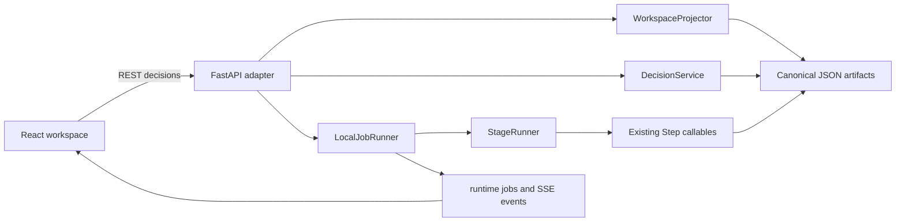

# Course Builder Studio — Frontend Implementation Handoff

> **Status:** Implemented local product prototype
> **Updated:** 2026-07-20
> **Scope:** React frontend, FastAPI adapter, browser workflow, and current UX contracts
> **Read with:** `Course_Builder_Master_Context.md` and `Course_Builder_Four_Week_Prototype_Completion_Handoff.md`

> **Next-cycle planning update — 2026-07-15:** The operator-ready follow-on cycle is
> defined in `Course_Builder_Next_Development_Cycle_Plan.md` and its technical-contract,
> implementation-backlog, and acceptance/pilot companion documents. This handoff remains
> authoritative for current behavior; the next-cycle package defines the target behavior
> and implementation order.

> **NC-10/NC-20/NC-30/NC-40 backend update — 2026-07-20:** NC-10 and
> NC-20 have passed independent review. The browser and API use explicit
> backend-projected capabilities, graph-derived invalidation, checksum-protected impact
> confirmation, server-side approval guards, explicit reopen, scoped Content revision,
> and retryable persisted failure state. Guided Brief Intake now adds canonical durable
> intake state, typed bounded question rounds, explicit default acceptance, deterministic
> conditional/gap clarification, backend approval/run gates, and reopen-protected partial
> editing. NC-301 and NC-302 have passed independent review: Outcomes
> now has strict backend reduction and a capability-gated typed editor that saves a
> canonical draft, survives refresh, protects unsaved work, resolves stale conflicts
> without silent loss, and leaves approval explicit. NC-303 remains deferred to NC-90
> behind NC-902. NC-401 through NC-403 are implemented with deterministic backend
> evidence but remain pending independent NC-40 backend checkpoint review. NC-40 is not
> complete. NC-404 through NC-406 and all later packages remain unstarted; Course Model
> browser editing stays disabled, and independent backend review—not NC-404—is the next
> action. Unsupported generic revision controls remain removed or disabled.

## 1. Purpose of this document

This is the canonical implementation context for Course Builder Studio, the browser
interface built on top of the completed Course Builder pipeline.

Read this document before changing the frontend, API adapter, stage projection, browser
workflow, or operator review experience. It records:

- the product interaction model;
- the implemented architecture and state flow;
- how the interface connects to the existing Python pipeline;
- what each stage currently shows and allows;
- important trust and persistence boundaries;
- known limitations and the safest extension points.

The older `Course_Builder_Frontend_Product_and_Implementation_Plan.md` records the
original product and architecture proposal. This handoff describes the implementation
that actually exists and takes precedence when the plan and current code differ.

## 2. What was built

Course Builder Studio is a desktop-first, artifact-oriented workspace for one course
director. It replaces the terminal as the primary review surface without replacing the
pipeline, artifact contracts, or orchestrator.

The implemented browser path supports:

- listing runtime courses and committed example courses;
- creating a course from a sparse subject request;
- durable Guided Brief intake with visible, explicitly accepted defaults;
- typed Outcomes editing with deterministic validation, advisory feedback, and explicit
  draft review;
- Live agent mode by default, with deterministic mode available;
- running one product stage at a time;
- persisted background jobs and Server-Sent Event progress;
- explicit stage approval and one registered scoped Student Content revision flow;
- automatic navigation to the next stage after approval;
- explicit source selection and a saved source registry;
- purpose-built views for all eight stages;
- claim-level Student Content review and verifier findings;
- durable per-asset human review decisions;
- targeted Content revision with bounded impact and preserved unrelated assets;
- Lesson Plan sequence and coverage review;
- Package release checks, rendered file tree, and Markdown file access;
- inspection of committed acceptance and live-run snapshots as read-only courses.

The product is still a local engineering prototype. It is not a hosted multi-user
application and it does not make first-pass live content automatically learner-ready.

## 3. Product model: a production workspace, not chat

The central interaction is:

`run one bounded stage -> inspect its structured artifact -> approve or request a scoped revision -> continue`

The interface deliberately does not provide a generic chat composer. Free text appears
only inside a guided revision dialog and is attached to a known stage, asset, or verifier
finding. This keeps operator decisions auditable and prevents an ambiguous conversation
from becoming hidden pipeline state.

The UI follows five rules:

1. **Artifacts are primary.** The stage output is the main surface.
2. **Status is explicit.** Ready, running, awaiting review, approved, attention, stale,
   failed, and locked are distinct states.
3. **Approval is a checkpoint.** Generation completing is not the same as human approval.
4. **Evidence stays near claims.** Student Content findings remain attached to the
   learner-facing claim and its assigned source.
5. **Defaults come first.** A new course starts with useful values instead of empty
   fields; the user changes only what is necessary.

## 4. User journey

### 4.1 Courses dashboard

Route: `/courses`

The dashboard lists runtime courses plus committed acceptance/live snapshots. Cards show
course status, current stage, attention count, progress, last update, and next action.
Filters separate all courses, courses needing attention, and ready courses.

If the API cannot be reached, representative demo data is displayed and mutations become
non-persistent preview actions.

### 4.2 Course creation

Route: `/courses/new`

The required input is a subject. Optional inputs include a practical goal, constraints,
and known source URLs.

The creation request may remain sparse. The backend saves the approved `subject_request`
and the first durable Brief draft in the same API operation; structured callers may
also include already-known Brief fields so a complete request receives no redundant
questions. Browser defaults do not silently count as human answers. The browser submits
the same deterministic course ID it displays, so connection-loss recovery returns to
the durable course that may already have been created.

The Brief route then shows at most five backend-projected mandatory questions per round.
Defaults such as level, duration, modality, prior knowledge, and English remain visible
but unresolved until the director explicitly accepts or replaces them. Conditional and
deterministic gap questions appear only when Python marks them applicable, with at most
three questions in the normal additional round. Answers are saved after every round and
survive refresh. The default run mode remains **Live agent**; NC-20 clarification itself
is deterministic in both modes until the NC-909 live implementation.

### 4.3 Course workspace

Routes:

```text
/courses/:courseId
/courses/:courseId/:stage
```

The workspace has four persistent regions:

- **Header:** course identity, connection/snapshot state, run-mode selector, active-run
  progress, optional cost estimate, Context toggle, and Activity entry point.
- **Workflow rail:** eight product stages with derived status and attention counts.
- **Stage canvas:** the purpose-built artifact view or a locked/running state.
- **Decision bar:** the one valid next action for the current stage state.

The Context inspector is optional and starts closed to keep the canvas uncluttered. Its
tabs explain why the stage exists, what evidence it uses, dependencies, activity history,
and raw normalized data.

## 5. Stage lifecycle and navigation

The backend derives stage state. React does not infer pipeline truth from timestamps or
local UI state.

```text
locked
  -> ready
  -> running
  -> awaiting_review or requires_attention
  -> approved
  -> next stage ready
```

Other recoverable states are `stale` and `failed`.

### Running a stage

1. The user clicks `Run <Stage>`.
2. The API accepts a versioned command and creates a persisted job.
3. The workspace switches to a full-stage agent working screen.
4. Human-safe status statements rotate while SSE events update real progress.
5. Navigation to unrelated stages is paused during the active mutation.
6. When `stage.output_ready` or `job.completed` arrives, TanStack Query invalidates the
   workspace projection and the saved artifact replaces the loading screen.

The progress surface never streams model chain-of-thought, full prompts, or source
bodies.

### Approving a stage

Approval is a separate synchronous command. On success, the frontend refreshes the
workspace and automatically moves to the next stage. The next screen presents its ready
state and the user runs it when prepared.

This is the intended flow:

`review -> approve -> move to next stage -> run next stage -> watch progress -> review`

Approval does not automatically start the next agent call. This preserves a deliberate
human checkpoint while removing the earlier manual navigation step.

### Requesting changes

Only Student Content currently registers a scoped free-text revision handler. It targets
named assets, accepts one of the backend-projected categories, previews the exact
affected and preserved assets, requires an acknowledged impact checksum, and recomputes
that impact while holding the course mutation lock before the job mutates artifacts. A
valid scoped Content revision preserves unrelated assets and the Lesson Plan while
making the Package outputs stale.

Outcomes exposes its registered typed structural decision only when backend-projected
capabilities allow editing. An approved Outcomes artifact must first use the existing
impact-confirmed Reopen flow. Course Model, Blueprint, Lesson Plan, and Package do not
expose generic free-text revision. Their unimplemented controls are disabled with a
truthful explanation until their typed commands arrive in later work packages. Failed
stages expose retry; stale stages expose rerun after their prerequisites are current.

### Locked and read-only states

Locked stages explain which upstream artifacts must be approved and link back to the
current stage. Committed example courses are projected into the same UI but all mutations
are disabled; their artifact and rendered-output roots remain read-only.

## 6. Implemented stage experiences

### 6.1 Brief

The Brief is a readable working agreement rather than a questionnaire transcript. It
shows course intent, level, duration, delivery, language, learner, prior knowledge,
assessment expectation, scope, required coverage, constraints, and assumptions.

While intake is incomplete, the page renders typed controls directly from serialized
`QuestionSpec` data. React does not own visibility or validation rules. The durable
`intake_state` distinguishes explicit human fields, accepted defaults, unresolved
decisions, answered question IDs, and current gap analysis; the review view makes that
provenance visible.

The operator can directly edit one bounded section at a time. The client submits only
changed fields, and the backend applies them through the same merge/validation path as
question answers. Approved Briefs must first be reopened with impact confirmation.
Saving creates a new draft without resetting unrelated answers or accepted defaults;
no-op edits are rejected. Stale answer and direct-edit checksums reload the current
workspace rather than leaving an editor trapped on an obsolete version.

### 6.2 Outcomes

Outcomes are displayed as an ordered set with measurable evidence and rationale. When
the backend projects the direct-edit capability, the operator can enter a typed editor,
change the statement, evidence, cognitive level, or priority, add an Outcome, remove one
after explicit confirmation, and reorder the complete set with keyboard-operable
controls. Cancel restores the current canonical server artifact; unsaved changes remain
visibly distinct from the saved state.

Retained Outcomes keep their canonical stable IDs when edited or reordered. New rows
use request-local client references for ordering; clients cannot supply canonical IDs.
Deterministic backend domain logic allocates the collision-free IDs returned after save
and persists a monotonic allocation cursor so removed IDs are never reused. A nonempty
`priority_order` is a complete order over every retained Outcome and request-local
addition reference. For backward compatibility, an omitted or empty order uses selected
Outcome order followed by addition order. Client references never become stored IDs.

The backend validates the complete resulting collection, not just individual patches,
and returns structured advisory checks for vague or non-observable verbs, duplicate or
near-duplicate statements, and mechanically weak evidence. Advisories do not block an
otherwise valid decision. Saving produces a new draft and refreshes the view from the
canonical response; it does not auto-approve. The draft survives refresh and requires
the normal explicit approval action. Editing is unavailable while the Brief gate is
unresolved, during an active mutation, or while Outcomes is approved. Approved editing
first follows capability-projected Reopen and impact confirmation. A stale checksum
never silently overwrites the server artifact: the editor refetches and rebases
nonoverlapping local work, then requires explicit choices for overlapping field or order
changes. No generic Outcomes revision control is exposed; NC-303 remains deferred to
NC-90 behind NC-902.

### 6.3 Research & Sources

This stage separates grounding sources from competitor curriculum evidence.

Source candidates show status, title, publisher/locator, relevance, trust notes, and
preview/reject controls. Candidate discovery does not count as human approval. The user
must select grounding sources and explicitly save the source registry before the stage
can be approved.

Rejected, proposed, unavailable, competitor-only, and contentless sources remain outside
Course Model mappings and generation context.

### 6.4 Course Model

The page uses a hierarchy-and-detail workspace. The left side contains modules and
ordered subtopics; the selected subtopic opens its purpose, metadata, scope contract,
concepts, coverage requirements, prerequisites, and approved source IDs.

It also exposes referential-integrity context. NC-401 through NC-403 now provide the
typed deterministic backend operation contract, stable ID allocation, and atomic
validation evidence, pending independent review. Inline structural editing, diff UI, and
scoped Course Model revision remain unstarted under NC-404 through NC-406; the visible
structural controls remain disabled.

### 6.5 Blueprint

The Blueprint is rendered as readable per-subtopic asset plans rather than a compressed
wide matrix. Course defaults are summarized once, filters separate all rows from
exceptions, and each plan shows timing/depth budget plus asset-selection state.

Course Content remains visibly marked as the required anchor. Selected, proposed, and
unselected assets are distinct. The existing API supports a typed Blueprint decision,
but the current React view is a review surface and does not expose a generic revision
fallback. Interactive controls remain deferred to NC-50.

### 6.6 Student Content

Before generation, the page shows a purposeful empty-artifact state explaining the
generation sequence and ready inputs. It does not render an empty three-column shell.

After generation, the page becomes a bounded three-part workbench:

- production board grouped by subtopic;
- formatted asset reader with Reader, Markdown, and Data views;
- verification panel with claim-level findings and repair choices.

The workbench uses independent scroll regions so long content does not stretch every
panel. The asset list opens a useful item automatically when asynchronous content arrives.

Verification semantics are important:

- `unsupported`, `ungrounded`, and `unattributed` are hard blockers;
- `partial` requires human evidence review but is not presented as a hard blocker;
- the UI reconciles counts from actual claims when available instead of trusting a stale
  aggregate blindly.

Per-asset human decisions are saved in the canonical `content_review` artifact. Marking
an asset reviewed cannot clear hard verifier blockers.

The implemented repair entry point revises only a named asset using currently approved
evidence. It is checksum protected, rejects unsupported or ambiguous targets before job
creation, rejects no-op or scope-escaping output without overwriting the prior artifact,
and resets human review only for changed content. The “find better evidence” action is
absent until the dedicated NC-70/NC-80 source-repair contract exists.

### 6.7 Lesson Plan

The Lesson Plan page presents a session timeline with duration, segments, delivery mode,
Course Model coverage, and numbered facilitation cues. The delivery contract summarizes
session count, total time, delivery modes, and break policy.

Coverage is calculated from the actual session mapping. Missing, duplicated, or unexpected
subtopics produce a warning rather than a misleading complete state.

Timing, mode, and order are not fake inline controls. The page states that structured
Lesson Plan changes are unavailable until the NC-60 command contract is implemented.

### 6.8 Package

Before the stage runs, the Package page shows an intentional pre-build state with the
three final steps: validate references, reconcile the release, and render Markdown. It
also warns when the package can be rendered for inspection but content blockers will
prevent release.

After rendering, the page shows:

- operator/release status;
- Course Model/render integrity;
- source-boundary check;
- selected/generated/rendered asset reconciliation;
- human-review and verifier blockers;
- a nested rendered-output tree;
- a formatted preview surface;
- direct access to the raw Markdown file.

The first Markdown document is selected automatically when the asynchronous render
manifest arrives. Folder labels do not replace the preview with an invalid selection.

The formatted preview is currently a clean representative document summary. `Open raw
file` serves the actual rendered Markdown. Fetching and rendering the complete selected
file inside the preview pane is a valid future enhancement.

## 7. Frontend architecture

### Stack

- React 19 and TypeScript;
- Vite 7 for development and production bundling;
- React Router for routes;
- TanStack Query for server state and mutations;
- React Markdown for generated content rendering;
- project-owned CSS and design tokens;
- Vitest and Testing Library for frontend tests.

Vite is only the client build and development tool. FastAPI remains the application/API
server and serves `frontend/dist` for the single-process local build.

### Key frontend files

| File | Responsibility |
|---|---|
| `frontend/src/app/App.tsx` | Route table. |
| `frontend/src/features/courses/CoursesPage.tsx` | Course dashboard and filters. |
| `frontend/src/features/courses/NewCoursePage.tsx` | Sparse course creation and mode selection. |
| `frontend/src/features/workspace/WorkspacePage.tsx` | Workspace shell, queries, mutations, SSE, navigation, inspector, dialogs, and decision bar. |
| `frontend/src/features/workspace/BriefQuestionRound.tsx` | Accessible typed Brief controls, explicit default acceptance, optional skip, and round validation. |
| `frontend/src/features/workspace/StageViews.tsx` | All eight purpose-built stage views. |
| `frontend/src/api/client.ts` | HTTP commands plus normalization from backend artifacts into UI types. |
| `frontend/src/types.ts` | Frontend view models and command types. |
| `frontend/src/data/demo.ts` | Representative offline/demo workspace data. |
| `frontend/src/styles/global.css` | Tokens, layout, stage styling, overlays, states, and responsive rules. |

### Server-state rule

TanStack Query owns remote state. Local React state is limited to UI concerns such as
the active tab, selected artifact, open dialog, filter, and current run progress. Do not
copy canonical artifact state into a client store or make browser storage authoritative.

### Normalization boundary

`frontend/src/api/client.ts` converts raw artifact bodies and the workspace projection
into stable UI models. Stage components should consume normalized `Workspace` data rather
than understand every historical artifact shape.

When a backend contract changes, update the projector/normalizer and tests first. Avoid
scattering fallback parsing across visual components.

## 8. FastAPI adapter architecture

The API is an adapter around existing domain code, not a replacement pipeline.



### Backend services

| Service | Responsibility |
|---|---|
| `ArtifactRepository` | Confined access to runtime artifacts, rendered output, and read-only examples; atomic saves and checksums. |
| `PipelineCatalog` | Maps existing pipeline steps to the eight product stages. |
| `ImpactPreviewService` / `InvalidationService` | Derive general or registered bounded impact from the catalog graph, protect previews with checksums, and preserve stale bodies. |
| `ApprovalGuardService` | Rechecks every human checkpoint on the server and returns structured failures. |
| `StageCapabilityService` | Projects only actions backed by registered domain operations. |
| `WorkspaceProjector` | Derives course summaries, stage states, counts, attention, next action, and active job. |
| `BriefIntakeService` | Provides the shared read-only normalization/readiness boundary for historical and new Briefs, injects bounded clarification, and merges answers/direct edits. Historical draft assumptions stay unresolved; approved pre-NC-20 snapshots remain compatible without a file rewrite. |
| `DecisionService` | Applies typed human decisions and approvals without moving artifact logic into the API. |
| `RevisionService` | Validates registered scoped revision targets and rejects ambiguous requests before queuing. |
| `StageRunner` | Executes the existing step callables for one stage and saves draft outputs. |
| `LocalJobRunner` | Persists jobs/events and enforces one active mutation per course. |

Every stage transitively downstream of `brief` derives that relationship from the
`PipelineCatalog` graph. Projection, approval, typed decisions, API preflight, and the
locked execution boundary all require the normalized Brief to be both resolved and
approved. An invalid historical approved Brief exposes impact-confirmed Reopen so it can
return to `needs_input` without bypassing the lifecycle.

### Implemented command surface

The current API includes:

```text
GET    /api/health
GET    /api/courses
POST   /api/courses
GET    /api/courses/{course_id}/workspace
GET    /api/courses/{course_id}/stages/{stage}
GET    /api/courses/{course_id}/artifacts/{artifact_type}

POST   /api/courses/{course_id}/stages/{stage}/run
POST   /api/courses/{course_id}/stages/{stage}/approve
POST   /api/courses/{course_id}/stages/{stage}/reopen
POST   /api/courses/{course_id}/stages/{stage}/impact
POST   /api/courses/{course_id}/stages/{stage}/revisions

GET    /api/courses/{course_id}/brief/questions
POST   /api/courses/{course_id}/brief/clarifications/run
PUT    /api/courses/{course_id}/brief/answers
PATCH  /api/courses/{course_id}/brief
PUT    /api/courses/{course_id}/outcomes/decision
PUT    /api/courses/{course_id}/research/sources/decision
PUT    /api/courses/{course_id}/blueprint/decision

GET    /api/courses/{course_id}/content/assets
GET    /api/courses/{course_id}/content/assets/{asset_id}
GET    /api/courses/{course_id}/content/reviews
POST   /api/courses/{course_id}/content/reviews/sync
PUT    /api/courses/{course_id}/content/reviews/{asset_id}

GET    /api/courses/{course_id}/outputs/{relative_path}
GET    /api/jobs/{job_id}
GET    /api/jobs/{job_id}/events
GET    /api/jobs/{job_id}/events/snapshot
```

All consequential mutations use expected checksums. A stale browser receives `409`
instead of overwriting newer artifact state.

## 9. Jobs, events, and recovery

Runtime execution state is separate from canonical course truth:

```text
runtime/<course_id>/
  jobs/<job_id>.json
  events/<job_id>.jsonl
  locks/mutation.lock
```

The local runner uses a bounded thread pool plus in-process and advisory file locks. It
allows only one mutation per course. Jobs interrupted by an API restart are marked failed
with a message that rerunning is safe. Existing artifact persistence and resume behavior
remain the recovery mechanism.

The first release should run with one API worker. Multiple API workers or multiple
simultaneous directors require a real distributed queue/lock design and are deliberately
deferred.

## 10. Persistence and trust boundaries

- Canonical course truth remains JSON under `courses/<course_id>/`.
- Rendered learner-facing files remain under `rendered_courses/<course_id>/`.
- `content_review` is canonical and records durable per-asset human decisions.
- Jobs and events under `runtime/` are disposable execution state.
- Committed courses under `examples/` are read-only snapshots.
- Provider credentials remain on the Python server. No API key is placed in Vite
  variables, browser storage, or frontend payloads.
- Course IDs, artifact types, and output paths are validated and confined.
- Generated Markdown is rendered without enabling raw HTML.
- Rejected sources and unselected assets remain enforced by the domain layer, not only
  hidden by the UI.

## 11. Local operation

Install dependencies once:

```bash
python3 -m venv .venv
.venv/bin/pip install -r requirements-dev.txt
cd frontend
npm install
```

Development uses two processes:

```bash
# project root
.venv/bin/uvicorn api.main:app --reload

# second terminal
cd frontend
npm run dev
```

Open `http://localhost:5173`. Vite proxies `/api` to FastAPI.

For a single-process local build:

```bash
cd frontend
npm run build
cd ..
.venv/bin/uvicorn api.main:app
```

FastAPI then serves the built studio and API from `http://127.0.0.1:8000`.

Live execution requires `ANTHROPIC_API_KEY` in the server environment or `.env`. The
browser defaults to Live agent mode but the operator can switch to Deterministic mode in
the creation form or workspace header.

## 12. Validation

Primary checks:

```bash
cd frontend
npm run build
npm test
npm run test:e2e
cd ..
.venv/bin/python -m pytest -q
.venv/bin/ruff check .
git diff --check
```

Important frontend/API regression files include:

- `frontend/src/api/client.test.ts`;
- `frontend/src/features/workspace/BriefQuestionRound.test.tsx`;
- `frontend/src/features/workspace/WorkspacePage.test.tsx`;
- `frontend/e2e/deterministic-course.e2e.ts`;
- `tests/test_guided_brief_intake.py`;
- `tests/test_frontend_integration_ui_contract.py`;
- `tests/test_frontend_integration_api.py`;
- `tests/test_frontend_integration_commands.py`;
- `tests/test_frontend_integration_projection.py`;
- `tests/test_frontend_integration_security.py`;
- `tests/test_api_http_contract.py`;
- `tests/test_api_jobs_and_reviews.py`;
- `tests/test_api_full_workflow.py`.

NC-30 validation additionally includes `tests/test_outcomes_decisions.py`,
`frontend/src/features/workspace/OutcomesEditor.test.tsx`, the Outcomes cases in
`frontend/src/features/workspace/WorkspacePage.test.tsx` and `StageViews.test.tsx`,
`frontend/src/api/client.test.ts`, and the bounded deterministic Outcomes path in
`frontend/e2e/deterministic-course.e2e.ts`. The independent checkpoint reran those
focused tests and the complete Python, frontend, build, and browser regression matrix.

The UI contract tests intentionally protect the artifact-first layout, pre-generation
states, source checkpoint, stage progression, structured Course Model/Blueprint views,
content verification workbench, Lesson Plan review, and Package default selection.

## 13. Known limitations

1. **Local single-director system.** There is no authentication, authorization,
   collaboration, or production deployment configuration.
2. **One API worker.** The current job runner and locks are not a distributed queue.
3. **Editing depth is uneven.** Brief and Outcomes typed editing, source decisions,
   content review, and scoped Content revision are wired. The Course Model backend
   contract is implemented through NC-403 pending independent review, but its browser
   editor remains unstarted and disabled under NC-404. Blueprint and Lesson Plan typed
   editing also remain unstarted; unsupported generic revisions are not exposed.
4. **Source repair is not closed-loop automation.** Better-evidence repair is not exposed
   until NC-70/NC-80 implement evidence acquisition, approval, rerouting, targeted
   regeneration, and reverification.
5. **Package preview is representative.** The selected raw Markdown is served correctly,
   but the inline pane does not yet fetch and render the complete selected file.
6. **Settings and full diagnostics are deferred.** Their navigation/actions are visibly
   unavailable rather than pretending to work.
7. **Desktop first.** Tablet and narrow layouts are functional, but dense authoring and
   claim review are best on desktop.
8. **Markdown output only.** Native DOCX/PPTX and generated-course-to-SCORM wiring remain
   later work.
9. **No generic pedagogical quality judge.** Verification checks evidence support; the
   human still owns instructional quality.
10. **Bundle size warning.** The current production JavaScript bundle is slightly above
    Vite's default 500 kB warning threshold. It is not a build failure, but route-level
    code splitting is a reasonable future optimization.

## 14. Rules for future frontend changes

1. Do not turn the workspace into a generic chat application.
2. Do not make React or browser storage authoritative for pipeline state.
3. Do not bypass `WorkspaceProjector` when deriving stage status.
4. Do not mark a generated artifact approved automatically.
5. Do not treat `partial` evidence as identical to a hard blocker, and do not hide it.
6. Do not let rejected/proposed sources appear approved because they were discovered by
   the agent.
7. Do not add fake enabled controls. Route unavailable edits through a truthful revision
   action or leave them visibly deferred.
8. Preserve pre-generation states for stages whose artifacts arrive asynchronously.
9. When asynchronous collections appear, initialize selections in an effect or derive a
   safe first selection; do not rely only on the first render's state initializer.
10. Keep package readiness separate from mechanical rendering. A folder can exist while
    the course still requires attention.
11. Keep provider credentials and model execution on the server.
12. Add or update UI contract tests when changing a stage's primary interaction model.

## 15. Recommended next frontend-related work

NC-301 and NC-302 have passed independent review. NC-303 remains deferred to NC-90
behind NC-902. NC-401 through NC-403 are implemented with deterministic backend evidence
but pending independent NC-40 backend checkpoint review. NC-40 is not complete: NC-404
through NC-406 and all later packages remain unstarted, and Course Model browser editing
stays disabled. The next action is the independent backend checkpoint review, not NC-404.
Source repair and verifier-driven targeted revision remain the central trust milestone,
but begin only after the intervening command contracts are stable.

After that, sensible frontend increments are:

1. render the actual selected Markdown file inside the Package preview;
2. wire typed Blueprint editing after the NC-40 Course Model contract is stable;
3. add structured Course Model edit commands with downstream impact confirmation;
4. add Lesson Plan constraint editing;
5. improve activity/model-call diagnostics without exposing private reasoning;
6. add focused browser acceptance and accessibility coverage;
7. split large routes/components if bundle growth continues.

## 16. Handoff summary

Course Builder Studio is now the working operator interface for the prototype. It
preserves the artifact pipeline and human checkpoint model while making stage outputs,
evidence, attention, revisions, progress, and final packaging understandable in the
browser. Guided Brief intake and typed Outcomes decisions now form the first two
independently verified, dependency-gated design checkpoints that can be completed
structurally without terminal or JSON intervention. The Course Model backend checkpoint
has implementation evidence through NC-403 but has not yet passed independent review or
enabled browser editing.

The implementation should be extended as a thin, truthful product layer over canonical
artifacts and typed commands. The frontend may improve how decisions are presented, but
it must never weaken source enforcement, verification, approval, resume, or structural
integrity contracts.
