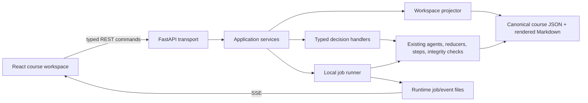

# Course Builder Frontend — Product and Implementation Plan

> Implementation status — 2026-07-13: the first vertical release described by
> this plan is implemented in `frontend/` and `api/`. It includes the eight-stage
> artifact workspace, read-only historical snapshots, course creation, stage
> execution and checkpoints, explicit source decisions, claim-level content
> review, targeted verifier-driven asset revision, persisted jobs/SSE, and the
> Markdown package gate. Rich inline editing for every structured artifact,
> automated source-gap repair, multi-user operation, and non-Markdown exports
> remain follow-on work.

> **Status:** Proposed for review
> **Date:** 2026-07-13
> **Scope:** Single-director browser interface for the completed Course Builder prototype
> **Primary constraint:** Preserve the existing artifact, approval, grounding, verification, and resume contracts

## 1. Recommendation

Build a **course-production workspace**, not a chat application.

The product should feel like a calm editorial control room in which the agent does
the work and returns structured proposals to the course director. The director sees
what changed, why it was recommended, what evidence supports it, and the exact
decision required to move forward.

The main interaction model is:

`agent runs a bounded stage -> workspace presents the artifact -> director approves or redirects -> only the affected scope reruns`

Free text remains useful, but it should always be attached to a known target such as
the Brief, one Course Model subtopic, one Blueprint override, one content asset, or a
set of verifier findings. There should be no unscoped message box labelled “Ask the
agent anything.”

The proposed product name in this document is **Course Builder Studio**. The name is
only a working label; the important decision is the workspace model.

## 2. Project understanding

The completed prototype is a domain-neutral, human-directed pipeline:

`subject request -> Brief -> Course Outcomes -> Research Dossier -> source approval -> Course Model -> Blueprint -> selected Student Content -> verification -> Lesson Plan -> rendered Markdown folder -> run summary`

Its product promise is not autonomous content generation. It is roughly 10x leverage
for one course director by moving the human from manual production to consequential
decisions and light, evidence-backed review.

The frontend must preserve these existing properties:

- One director owns a course end to end.
- Consequential stages stop at explicit checkpoints.
- The system distinguishes an agent recommendation from a human decision.
- The compact Course Model remains the structural source of truth.
- The Blueprint controls the exact assets generated for each subtopic.
- Only approved, assigned source excerpts enter generation context.
- Verification is an attention gate, not decorative metadata.
- Revisions rerun the smallest affected stage, subtopic, or asset.
- Approved current artifacts remain resumable.
- Plain JSON artifacts remain the prototype system of record.
- The orchestrator remains an opaque engine; the frontend does not add UI fields to
  its lifecycle envelope.

The live prototype also establishes the frontend’s highest-value problem: an operator
needs to review weak sources and verifier blockers quickly. The interface must make
“find better evidence” and “revise with existing evidence” visibly different actions.

There is also a useful historical migration case in the committed live snapshot:
`coffee-live-main` contains 5 unsupported, 1 ungrounded, and 3 unattributed findings,
while its older `run_summary.json` still says `complete`. Current run-summary code would
classify those findings as `requires_attention`. The frontend projection must apply the
current attention rule to underlying artifacts instead of blindly trusting an older
summary snapshot.

## 3. Product principles

### 3.1 Attention over conversation

The home state of a course should answer:

1. What is the agent doing now?
2. What needs my decision?
3. What is blocked or unsafe?
4. What will happen if I approve or change this?

A chronological chat transcript answers none of those reliably once a course contains
dozens of artifacts and revisions.

### 3.2 Artifact-first review

The primary object on every stage screen is the artifact or decision being reviewed.
Agent commentary, rationale, provenance, and history are secondary panels around it.
Raw JSON is always available for engineering diagnostics, but it is never the default
view for an operator.

### 3.3 Structured decisions with scoped free text

Use typed fields, selects, checkboxes, tables, and direct manipulation for bounded
decisions. Use free text only for nuance or a revision instruction, and bind it to an
explicit scope before submission.

Examples:

- Good: “Revise `m1_s4_assess` using these two verifier findings.”
- Good: “Research more evidence for grind-size extraction in `m1_s4`.”
- Good: “Rename this subtopic and keep its current source assignments.”
- Avoid: “Make the course better.”

### 3.4 Defaults first, exceptions second

Course-wide defaults should be accepted once. The UI should then highlight the small
number of subtopics that differ. This is especially important for Blueprint asset
selection and depth budgets.

### 3.5 Evidence stays next to claims

When reviewing generated content, the operator should be able to select a claim and
see its source excerpt and verification verdict without navigating away. Unsupported,
ungrounded, and unattributed claims must remain visually prominent until resolved.

### 3.6 Status must be unambiguous

Do not use a generic “done” state. The interface must distinguish generated, awaiting
review, approved, requires attention, stale, failed, and ready for packaging.

### 3.7 Upstream edits show downstream impact

Reopening an approved Brief, source decision, Course Model, or Blueprint can make
downstream artifacts stale. Before the change is submitted, the UI should show the
stages and assets that will be invalidated and regenerated.

## 4. Information architecture

The application has three top-level areas.

| Area | Purpose |
|---|---|
| **Courses** | List courses, their current state, last activity, completion, and next required action. |
| **Course Workspace** | Run and review one course through the eight product stages. |
| **Settings** | Local provider/API-key readiness, model/cost defaults, output location, and diagnostic information. Keep this minimal in the first release. |

Recommended routes:

```text
/courses
/courses/new
/courses/:courseId
/courses/:courseId/brief
/courses/:courseId/outcomes
/courses/:courseId/research
/courses/:courseId/course-model
/courses/:courseId/blueprint
/courses/:courseId/content
/courses/:courseId/content/:subtopicId/:assetId
/courses/:courseId/lesson-plan
/courses/:courseId/package
```

The backend has more executable steps than the user-facing product has stages. Keep
the user-facing workflow aligned with the context documents:

| Product stage | Current executable steps/artifacts |
|---|---|
| Brief | `intake` -> `brief` |
| Outcomes | `course_outcomes` |
| Research & Sources | `research` + `source_selection` |
| Course Model | `structure` |
| Blueprint | `blueprint` |
| Student Content | `student_content` + verification |
| Lesson Plan | `lesson_plan` |
| Package | `render_course_folder` + `run_summary` |

## 5. The Course Workspace

### 5.1 Desktop layout

The product is desktop-first because source comparison, structure editing, and claim
verification require width. Tablet should remain functional; mobile may be read-only
for the first release.

```text
┌────────────────────────────────────────────────────────────────────────────────┐
│ Course Builder       Coffee Making                         Saved  •  $2.50 est. │
├──────────────────┬─────────────────────────────────────────────┬───────────────┤
│ COURSE WORKFLOW  │ STAGE CANVAS                                │ INSPECTOR     │
│                  │                                             │               │
│ ✓ Brief          │ Stage title + concise agent summary         │ Why proposed  │
│ ✓ Outcomes       │                                             │ Evidence      │
│ ✓ Research       │ The stage-specific artifact editor/reviewer │ Dependencies  │
│ ✓ Course Model   │                                             │ History       │
│ ✓ Blueprint      │                                             │ Raw data      │
│ ! Content   6    │                                             │               │
│ ○ Lesson Plan    │                                             │               │
│ ○ Package        │                                             │               │
│                  ├─────────────────────────────────────────────┴───────────────┤
│ Activity ▾       │ Request changes                    Approve & continue       │
└──────────────────┴─────────────────────────────────────────────────────────────┘
```

### 5.2 Persistent regions

**Workflow rail**

- Shows all eight stages and their derived status.
- Displays blocker or review counts, not decorative percentages.
- Allows inspection of approved prior stages.
- Requires an explicit “Reopen stage” action before an approved artifact can change.

**Stage canvas**

- Uses a purpose-built view for the current artifact.
- Keeps the primary work readable at normal zoom.
- Supports a focused reading mode for long generated content.

**Context inspector**

- “Why” shows recommendation rationale and structural provenance.
- “Evidence” shows source assignments and excerpts.
- “Dependencies” shows what this artifact consumes and what it affects.
- “History” shows approval, revision, and run events.
- “Raw data” exposes the canonical JSON for debugging.

**Sticky decision bar**

- Shows the one primary action for the current state.
- Uses stage-specific secondary actions.
- Never labels a free-text submission simply “Send.”

**Activity drawer**

- Contains timestamped system events, model-call summaries, retries, cache hits, and
  errors.
- It is an audit/debug surface, not the main interaction surface.

## 6. Stage designs

### 6.1 Course creation and Brief

The user starts with a subject, an optional description, constraints, and known source
links. The course ID is previewed but normally generated by the system.

The Brief is built in small question rounds. Each round is rendered as a form card with
at most three to five related questions. The interface displays why a question matters,
safe defaults, conditional fields, and visible agent assumptions.

Review mode groups the final Brief into audience, learning intent, delivery, scope,
constraints, and assumptions. The director approves the summarized artifact rather
than rereading a questionnaire transcript.

Primary actions:

- `Save answers & continue`
- `Accept visible defaults`
- `Request one more clarification round`
- `Approve Brief`

### 6.2 Course Outcomes

Render outcomes as an ordered editable list. Each row contains the measurable outcome,
rationale, and any priority marker. The director can edit, add, remove, and reorder
outcomes before approval.

The screen should flag vague verbs or obvious duplicates but leave pedagogical judgment
to the human.

Primary actions:

- `Accept recommended outcomes`
- `Add outcome`
- `Approve Outcomes`

### 6.3 Research & Sources

This stage needs two coordinated workspaces.

**Competitor landscape**

- Competitor list with usable/partial/failed outline status.
- Extracted outlines in original order.
- Normalized topic coverage matrix.
- Common-core, sequence, gap, and differentiation observations.
- Structural implications linked to outcomes.

**Grounding sources**

- Candidate cards with title, publisher, source type, locator, trust note, relevance
  note, fetch status, and a bounded content preview.
- Coverage indication by Course Model topic or evidence need where available.
- Explicit approve/reject controls; recommendation is visually separate from decision.
- Ability to add a known source URL.
- A decision tray summarizing selected and rejected IDs before confirmation.

Competitor pages must be visibly labelled “curriculum evidence” unless separately
approved as factual grounding sources.

Primary actions:

- `Run another bounded research pass`
- `Add known source`
- `Confirm source decisions`
- `Approve Research & Sources`

### 6.4 Course Model

Use a hierarchical course map rather than a JSON editor.

- The left side of the canvas shows modules and ordered subtopics.
- Selecting a node opens its purpose, in/out of scope, concepts, dependencies,
  coverage requirements, outcomes, source assignments, and structural rationale.
- Source coverage gaps and invalid references are visible before approval.
- Add, rename, reorder, and remove operations are structured commands validated by the
  backend so stable IDs and referential integrity are preserved.

The impact panel should explain whether a structural edit will require Blueprint-only
regeneration or will also invalidate existing content.

Primary actions:

- `Add module/subtopic`
- `Request scoped structural revision`
- `Validate Course Model`
- `Approve Course Model`

### 6.5 Blueprint

Use a matrix with subtopics as rows and asset types as columns. Selected, proposed, and
rejected assets use distinct states. Course Content is marked as the anchor asset.

A course-defaults panel controls depth, learning minutes, target word range, example
count, case depth, assessment complexity, and the recommended asset set. Rows with
overrides display an exception badge and can be filtered.

The UI should prevent a subtopic from silently losing its Course Content anchor and
should require an explicit waiver when allowed by the contract.

Primary actions:

- `Apply defaults to all`
- `Edit selected subtopics`
- `Review exceptions only`
- `Approve Blueprint`

### 6.6 Student Content and Verification

This is the core product screen. It combines a production board, a content reader, and
an attention queue.

**Production board**

- Module -> subtopic -> asset hierarchy.
- Per-asset generation, retry, verification, and human-review status.
- Current/expected unit count and live progress.
- Filters for “waiting,” “blocked,” “failed,” and “approved.”

**Content reader**

- Renders the asset’s learner content cleanly.
- Keeps teacher-only solution material visibly separated.
- Supports selecting a passage or claim as revision context.
- Offers Markdown and structured/raw-data tabs.

**Verification inspector**

- Lists supported, partial, unsupported, ungrounded, and unattributed findings.
- Selecting a finding highlights the related claim and opens the cited source excerpt.
- Groups blockers by likely cause: weak evidence, missing attribution, or generation
  error.

**Repair actions**

- `Revise with approved evidence` regenerates only selected assets and reverifies them.
- `Find better evidence` reopens Research & Sources scoped to the affected subtopic and
  claim gaps.
- `Reduce scope` proposes a Course Model/Blueprint change and shows downstream impact.
- `Mark reviewed` records the human decision but cannot clear verifier blockers.

The first frontend release should add a small persisted `content_review` artifact (or an
equivalent explicitly versioned contract) because the current package stores generated
and verification state but not durable per-asset human review decisions. Consequential
review decisions should not live only in browser memory or an activity log.

### 6.7 Lesson Plan

Use a session timeline with duration, delivery mode, covered subtopics, activities, and
teacher talking points. A constraints panel controls session count, available time,
live/self-study/blended delivery, breaks, and emphasis.

Show uncovered or duplicate subtopics before approval.

Primary actions:

- `Adjust constraints`
- `Move item to live/self-study`
- `Regenerate affected session`
- `Approve Lesson Plan`

### 6.8 Package

The final screen is a release checklist, not a celebratory success page.

- Integrity status.
- Operator status and unresolved verifier blockers.
- Approved source count and rejected-source leakage check.
- Selected/generated/rendered asset reconciliation.
- Rendered folder tree and Markdown preview.
- Output paths and a downloadable ZIP when implemented.
- Clear statement that Markdown is the current output format.

`Ready` is available only when integrity passes, required human reviews are complete,
and unsupported, ungrounded, or unattributed blockers are zero.

## 7. Visual direction

The visual language should be editorial and operational rather than “AI futuristic.”

- Warm neutral application background, white reading surfaces, dark slate text.
- One calm indigo or deep blue accent for active state and primary actions.
- Green only for approved/verified states, amber for attention, red for blockers.
- No gradients, glass effects, animated chat bubbles, or oversized cards.
- Dense tables where comparison matters; spacious reading surfaces where prose matters.
- Clear typography hierarchy and restrained use of icons.
- Status is always communicated with text and shape, not color alone.
- Keyboard-accessible controls, visible focus states, and AA contrast are required.

Use a small project-owned component system built from design tokens and accessible
headless primitives. Avoid adopting a large visual component suite that dictates the
product’s appearance.

## 8. Frontend state model

The browser should render a derived product state without changing the orchestrator’s
fixed artifact lifecycle fields.

| UI state | Meaning |
|---|---|
| `locked` | Required upstream artifacts are not approved. |
| `ready` | Inputs are approved and the stage may run. |
| `running` | A stage or targeted unit job is active. |
| `awaiting_review` | A draft artifact exists and needs a human decision. |
| `approved` | The artifact is approved and current for its inputs. |
| `requires_attention` | Evidence, verification, or review blockers remain. |
| `stale` | The artifact predates a changed input or its input contract changed. |
| `failed` | The last job failed and may be retried or repaired. |

These states are calculated by a backend workspace projection from artifact envelopes,
input timestamps/contracts, progress records, verification findings, content reviews,
and active jobs. The frontend must not independently infer pipeline truth from file
timestamps.

## 9. Technical architecture

### 9.1 Recommended stack

**Frontend**

- React + TypeScript.
- Vite as the client build tool; this project already has a Python backend and does not
  need SSR, React Server Components, or a second application server.
- React Router for client-side routes.
- TanStack Query for API server state, mutation state, invalidation, and retry handling;
  avoid Redux unless a concrete cross-feature client-state problem appears.
- Accessible headless UI primitives plus project-owned styling and CSS variables.
- A Markdown renderer with raw HTML disabled and generated content sanitized.
- Vitest + Testing Library for component tests and Playwright for browser acceptance.

Vite officially provides a React TypeScript template and production build path, and
React’s guidance for adding React to an existing non-JavaScript backend points to Vite
when no module build setup exists. TanStack Query is specifically designed around
remote server state rather than treating it as ordinary client state.

**Backend adapter**

- FastAPI in the existing Python repository.
- Pydantic request/response models and generated OpenAPI documentation.
- A generated TypeScript API client so backend command contracts and frontend types do
  not drift.
- REST commands for user actions and Server-Sent Events (SSE) for one-way progress
  updates. Actions remain normal POST/PATCH requests.

FastAPI’s typed request bodies provide validation and OpenAPI schemas, and current
FastAPI releases provide first-class SSE responses. SSE matches this product because
the server sends progress events while the client sends decisions through ordinary
HTTP commands; WebSockets add no useful capability to the first release.

### 9.2 Layering



The API is an adapter around the existing domain code, not a rewrite of it.

### 9.3 Required application services

**ArtifactRepository**

- Lists courses and loads/saves canonical artifact envelopes through the current storage
  rules.
- Validates course IDs and confines file access to configured artifact/output roots.
- Provides artifact checksums/ETags for optimistic concurrency.

**PipelineCatalog**

- Exposes the ordered step definitions currently assembled in `run.py`.
- Maps the ten executable steps to the eight user-facing stages.
- Describes prerequisite and downstream dependencies without placing artifact-specific
  behavior in the orchestrator.

**WorkspaceProjector**

- Produces summaries, stage states, attention items, next actions, and counts.
- Keeps the React application from coupling to every raw artifact body.
- Lazy-loads large content assets instead of returning the full Content Package on every
  workspace refresh.

**DecisionService**

- Accepts typed Brief answers, outcome edits, source decisions, Course Model edits,
  Blueprint decisions, content review decisions, revision requests, and lesson-plan
  constraints.
- Calls existing deterministic reducers such as source and Blueprint decision functions.
- Does not encode structured choices into comma-separated or JSON-in-a-string feedback.

**StageRunner**

- Runs one stage, one subtopic, or one asset rather than holding an entire pipeline call
  open across browser checkpoints.
- Reuses existing step functions, validation, caching, integrity checks, and resume
  behavior.
- Marks produced artifacts draft; approval remains a separate command.

**LocalJobRunner**

- Assigns a job ID, persists status, and executes long synchronous work outside the
  request event loop.
- Emits stage and per-asset events.
- Enforces one mutating job per course with a per-course lock.
- May use a bounded in-process thread executor for the single-user prototype. It should
  not use FastAPI’s generic fire-and-forget background-task helper because these jobs
  need IDs, progress, cancellation state, and durable recovery information.
- A process restart may interrupt the active call, but persisted artifacts let the user
  resume safely. Redis/Celery or another distributed queue is deferred until multiple
  workers or users create a real need.

### 9.4 Runtime state

Keep canonical artifacts where they are. Store non-canonical UI execution state
separately, for example:

```text
runtime/<course_id>/
  jobs/<job_id>.json
  events/<job_id>.jsonl
  locks/
```

Runtime files may be deleted without changing approved course truth. Human source,
Blueprint, and content-review decisions remain canonical artifacts, not runtime files.

### 9.5 Progress event contract

Use a small versioned event vocabulary:

```text
job.queued
job.started
stage.started
unit.started
unit.completed
unit.failed
stage.output_ready
checkpoint.awaiting_review
stage.approved
job.completed
job.failed
```

Each event includes `event_id`, `job_id`, `course_id`, timestamp, stage, optional
subtopic/asset IDs, progress counts, and a human-safe message. Do not stream model
chain-of-thought or full prompts.

## 10. Initial API surface

The names may change during contract tests, but the command boundaries should remain.

```text
GET    /api/courses
POST   /api/courses
GET    /api/courses/{course_id}/workspace
GET    /api/courses/{course_id}/stages/{stage}
GET    /api/courses/{course_id}/artifacts/{artifact_type}

POST   /api/courses/{course_id}/stages/{stage}/run
POST   /api/courses/{course_id}/stages/{stage}/approve
POST   /api/courses/{course_id}/stages/{stage}/reopen
POST   /api/courses/{course_id}/stages/{stage}/request-changes

PUT    /api/courses/{course_id}/brief/answers
PUT    /api/courses/{course_id}/outcomes/decision
PUT    /api/courses/{course_id}/research/source-decision
POST   /api/courses/{course_id}/research/sources
PATCH  /api/courses/{course_id}/course-model
PUT    /api/courses/{course_id}/blueprint/decision

GET    /api/courses/{course_id}/content/assets
GET    /api/courses/{course_id}/content/assets/{asset_id}
POST   /api/courses/{course_id}/content/revise
POST   /api/courses/{course_id}/content/research-more
PUT    /api/courses/{course_id}/content/reviews/{asset_id}
POST   /api/courses/{course_id}/content/reverify

PUT    /api/courses/{course_id}/lesson-plan/constraints
GET    /api/courses/{course_id}/outputs/{path}
GET    /api/jobs/{job_id}
GET    /api/jobs/{job_id}/events
```

All mutation requests include an expected artifact version/checksum. A stale browser
receives `409 Conflict` with the latest summary instead of overwriting newer work.

## 11. Security and trust boundaries

Even a local-first prototype must enforce a few boundaries:

- Bind the development API to localhost by default.
- Keep model API keys only on the Python server; never expose them to Vite environment
  variables or browser storage.
- Validate course IDs, artifact types, and output paths against allowlists.
- Prevent path traversal when serving rendered files and source previews.
- Render generated Markdown with raw HTML disabled and sanitize links/content.
- Do not return full source bodies in workspace summaries; fetch bounded excerpts only
  when the user opens evidence.
- Do not send private prompts, source bodies, or model reasoning to activity events.
- Preserve the existing rejected-source and unselected-asset negative gates at the API
  boundary as well as in domain integrity checks.

Authentication, roles, and multi-user collaboration are deliberately deferred. Keeping
all browser mutations behind a typed API makes those additions possible later without
rewriting the frontend’s domain interactions.

## 12. Proposed repository layout

```text
course_builder_system/
  api/
    main.py
    models/
    routes/
    services/
      artifact_repository.py
      pipeline_catalog.py
      workspace_projector.py
      decision_service.py
      stage_runner.py
      local_job_runner.py
    tests/
  frontend/
    package.json
    vite.config.ts
    src/
      app/
      api/
      components/
      features/
        courses/
        brief/
        outcomes/
        research/
        course-model/
        blueprint/
        content/
        lesson-plan/
        package/
      styles/
    tests/
  runtime/                  # ignored, non-canonical execution state
```

Do not move the existing agents, steps, schemas, prompts, or orchestrator into a web
framework directory. The API depends on the domain; the domain does not depend on the
API or React application.

## 13. Implementation sequence

The interface should be built in vertical slices against deterministic fixtures before
spending live model or research calls.

### Slice 0 — Contract and design foundation

**Backend**

- Extract a reusable PipelineCatalog without changing `run.py` behavior.
- Add ArtifactRepository and WorkspaceProjector.
- Define Pydantic view models, commands, stage states, job states, and progress events.
- Add API contract tests using the committed acceptance and live-run snapshots.

**Frontend**

- Establish design tokens, application shell, workflow rail, inspector, decision bar,
  route structure, and API client generation.
- Build loading, empty, error, stale, attention, and approved states before stage polish.

**Exit gate**

- The API can project `coffee-acceptance` and `coffee-live-main` without mutating them.
- Stage states and verifier attention counts are deterministic.
- The historical `coffee-live-main` summary mismatch is surfaced as
  `requires_attention`, with the underlying blocker counts visible.

### Slice 1 — Read-only course explorer

- Course dashboard.
- All eight stage viewers.
- Course Model hierarchy, Blueprint matrix, Content reader, verification inspector,
  Lesson Plan timeline, and rendered folder browser.
- Raw artifact and activity/debug views.

**Exit gate**

- A reviewer can inspect the full archived live run in the browser and identify every
  flagged content asset without opening JSON or Markdown files manually.

This slice validates the information architecture before command handling makes the UI
more expensive to change.

### Slice 2 — Course creation and upstream checkpoints

- Create course from sparse subject request.
- Typed Brief question rounds.
- Outcome editing/selection.
- Research jobs and source previews.
- Explicit source approval/rejection and known-source addition.
- Course Model structured edits with impact preview.
- Blueprint defaults and per-subtopic exceptions.
- Stage run, approve, request-change, reopen, and resume commands.
- LocalJobRunner and SSE progress.

**Exit gate**

- A deterministic course can be created from subject request through approved Blueprint
  entirely in the browser.
- Rejected sources cannot enter the Course Model.
- Refreshing or stopping/restarting the UI preserves checkpoint state.

### Slice 3 — Content production and repair loop

- Production board and per-asset progress.
- Content reader, claims, source excerpts, and verifier findings.
- Persisted per-asset content review.
- Targeted revision using existing evidence.
- Source-repair action scoped from a verifier finding.
- Rerouting, regeneration, and reverification of affected assets only.
- `requires_attention` remains until blockers are cleared.

This slice must include the next backend work package from the completion handoff:
source repair plus verifier-driven targeted revision. A polished frontend cannot paper
over a missing repair loop.

**Exit gate**

- A verifier blocker can be resolved by better evidence or targeted revision.
- Unaffected assets remain byte-for-byte unchanged.
- The operator can see why the course is or is not learner-ready.

### Slice 4 — Lesson Plan, package, and hardening

- Lesson-plan constraint editing and approval.
- Final acceptance checklist and rendered-output preview.
- ZIP download of the approved Markdown folder if desired for the MVP.
- Per-course mutation locks, optimistic concurrency, error recovery, and cancellation
  messaging.
- Accessibility, responsive behavior, visual regression, and browser acceptance tests.
- Operator documentation and local start commands.

**Exit gate**

- The deterministic end-to-end acceptance scenario runs from a new course to a rendered
  folder in the browser.
- Integrity passes and final status is complete only when blockers are zero.

## 14. Suggested four-week team split

This is a target sequence for two engineers, not a commitment before contract review.

| Week | Platform/API owner | Frontend/product owner | Shared gate |
|---|---|---|---|
| 1 | Artifact repository, pipeline catalog, projections, API models | App shell, visual system, read-only artifact views | Archived coffee run is fully reviewable |
| 2 | Typed commands, stage runner, job state, SSE | Brief through Blueprint interactions | Browser reaches approved Blueprint |
| 3 | Source-repair and targeted-revision services, content-review contract | Production board, reader, evidence and attention queue | One flagged asset is repaired without broad regeneration |
| 4 | Packaging endpoints, locking, recovery, security checks | Lesson Plan, package, accessibility and E2E polish | Deterministic browser acceptance passes |

If the source-repair backend requires more time, reduce visual polish and ZIP packaging;
do not weaken verification behavior or fake a “ready” state.

## 15. Test strategy

### Backend

- Unit tests for workspace status projection and downstream invalidation.
- Contract tests for every typed command and view model.
- Existing schema, integrity, source-leakage, asset-selection, verification, revision, and
  resume tests remain green.
- API tests for path confinement, optimistic concurrency, and per-course locks.
- Job-runner tests use deterministic generators and mocked research.

### Frontend

- Component tests for typed questions, source decision cards, Course Model tree,
  Blueprint matrix, verification findings, impact preview, and decision bar.
- Accessibility tests for keyboard flow, focus management, labels, and status text.
- Visual snapshots for the Course Model, Blueprint, Content review, and attention states.

### Browser acceptance

1. Create a deterministic coffee course.
2. Complete Brief and Outcomes.
3. Approve some sources and reject at least one.
4. Verify the rejected source never appears downstream.
5. Approve Course Model and choose different Blueprint assets for two subtopics.
6. Generate content while observing unit progress.
7. Refresh during the run and recover the current state.
8. Trigger a verifier blocker.
9. Revise or repair only the affected asset and reverify it.
10. Approve Lesson Plan and render the folder.
11. Confirm integrity and final operator status.

## 16. MVP scope and deliberate deferrals

### MVP includes

- Course dashboard and creation.
- Full eight-stage workspace.
- Typed checkpoints and explicit decisions.
- Source preview and approval.
- Course Model and Blueprint purpose-built views.
- Live per-stage and per-asset progress.
- Content, claim, source, and verifier review.
- Targeted revision and source-repair entry points.
- Resume, error recovery, and final Markdown output review.

### Deferred

- Multi-user authentication, roles, comments, and real-time collaboration.
- Mobile authoring.
- Generic agent chat.
- A generic workflow-builder UI.
- WYSIWYG PowerPoint/Word editing.
- Native DOCX/PPTX styling and full SCORM wiring.
- Distributed queues, Redis, Celery, or multiple server workers.
- RAG/vector search.
- Rich cost analytics and organization-wide dashboards.
- Automatic pedagogical-quality judgment.

## 17. Decisions to approve before implementation

1. **Product model:** approve the stage workspace and contextual command surface instead
   of a chat-first interface.
2. **MVP depth:** approve full browser operation through Markdown packaging, including
   the content verification/repair workflow.
3. **Stack:** approve React/TypeScript/Vite plus a FastAPI adapter around the existing
   Python domain.
4. **Persistence:** keep canonical JSON artifacts; add separate disposable runtime job
   files and a small canonical content-review contract.
5. **Execution:** use one bounded local job runner and SSE for the single-director MVP;
   defer distributed infrastructure.
6. **Responsive boundary:** desktop-first authoring, tablet functional, mobile review
   only.
7. **Schedule:** target four vertical-slice weeks for two engineers, with source repair
   and correctness taking priority over packaging and visual polish.

## 18. First implementation task after approval

Start with Slice 0 and Slice 1 against the committed `coffee-acceptance` and
`coffee-live-main` snapshots. The first demonstrable milestone should be a read-only
browser workspace that makes the archived live run, its sources, its 18 assets, and its
verification problems substantially easier to review than the current terminal and
folder workflow.

Only after that review model is validated should the team wire browser mutations and
live agent jobs into it.

## References for the proposed web stack

- [React: add React to an existing project](https://react.dev/learn/add-react-to-an-existing-project)
- [Vite: React TypeScript templates and build tooling](https://vite.dev/guide/)
- [FastAPI: typed request bodies and OpenAPI schemas](https://fastapi.tiangolo.com/tutorial/body/)
- [FastAPI: Server-Sent Events](https://fastapi.tiangolo.com/tutorial/server-sent-events/)
- [TanStack Query: server-state model](https://tanstack.com/query/latest)
- [MDN: Server-Sent Events are a one-way server-to-client channel](https://developer.mozilla.org/en-US/docs/Web/API/Server-sent_events/Using_server-sent_events)
